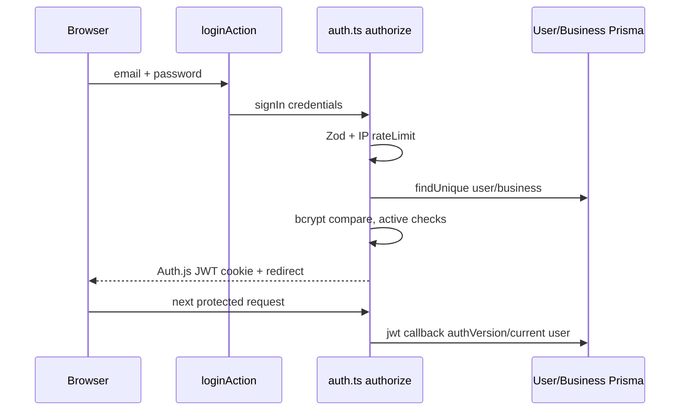
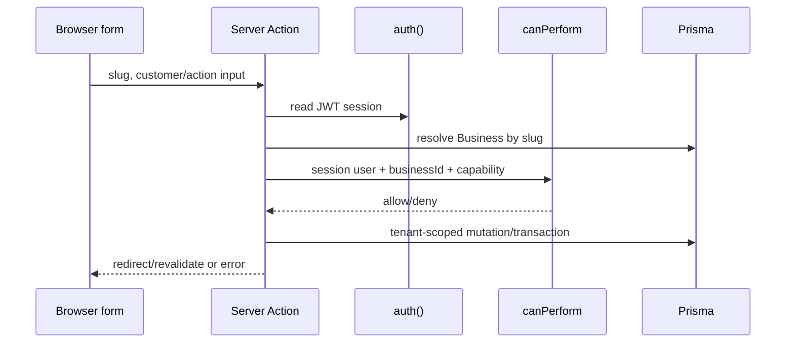
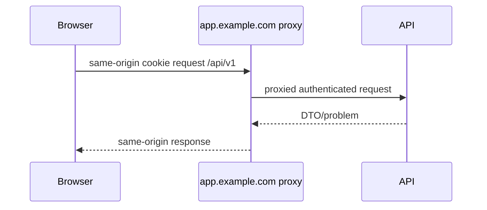
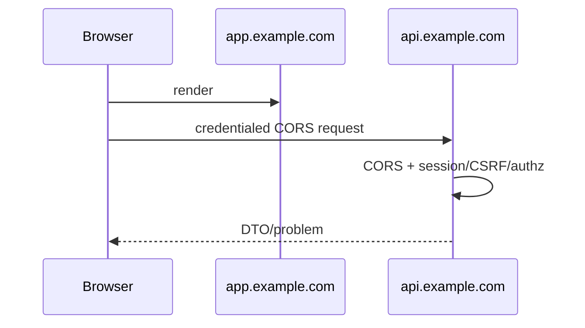
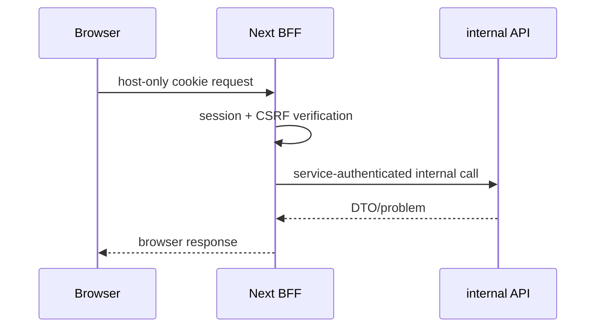
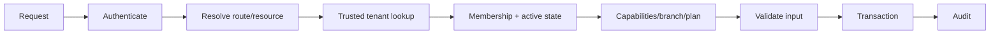
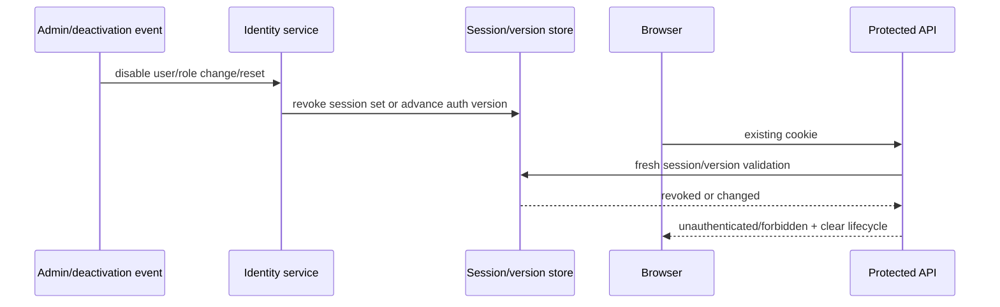

# Authentication and Tenancy Target Design

This document separates **CONFIRMED** current repository behavior from the target
recommendations. It complements the current/target architecture documents and does
not change providers, cookies, schema, or deployment configuration.

## 1. Current authentication inventory — CONFIRMED

| Path / symbol | Responsibility | Trust boundary | Current limitation | Target owner |
|---|---|---|---|---|
| [`auth.ts`](../../auth.ts) / `NextAuth`, `Credentials` | credentials provider, bcrypt verification | server-only credential validation | identity, sessions and Prisma are tied to Next runtime | identity/API |
| `auth.ts` / `authorize` | validates email/password, rate limits address, reads active user/business | untrusted credentials → `User` | process-local rate limiter; no password-reset flow | identity |
| `auth.ts` / `callbacks.jwt` | refreshes user/role/business/authVersion | signed session → current DB state | database read on session use; token lifetime not overridden here | identity |
| `auth.ts` / `callbacks.session` | projects `id`, `role`, `businessId` onto `session.user` | server session → page/action | client-visible session fields are not authorization truth | identity |
| `auth.ts` / `session.strategy: "jwt"` | selects JWT session strategy | Auth.js default cookie implementation | no explicit cookie config is present | identity/platform |
| [`app/api/auth/[...nextauth]/route.ts`](../../app/api/auth/[...nextauth]/route.ts) / `handlers` | exposes Auth.js GET/POST | HTTP auth boundary | shares one web deployment | identity/API |
| [`app/login/page.tsx`](../../app/login/page.tsx) | login form/redirect when already authenticated | browser input | UI-level errors only | web |
| [`app/login/actions.ts`](../../app/login/actions.ts) / `loginAction` | calls `signIn` and redirects | Server Action | form contract is not versioned API | web adapter |
| [`app/dashboard/actions.ts`](../../app/dashboard/actions.ts) / `logoutAction` | `signOut({ redirectTo: "/login" })` | authenticated browser → cookie clearing | session revocation depends on Auth.js/JWT + authVersion checks | identity |
| `app/**/page.tsx` / `auth()` | reads session on protected pages | server-render request boundary | protection is distributed | API identity middleware |
| [`lib/auth/password-policy.ts`](../../lib/auth/password-policy.ts) | password length/confirmation schemas | server action validation | no self-service reset token/provider exists | identity |
| [`app/businesses/[slug]/users/actions.ts`](../../app/businesses/[slug]/users/actions.ts) / `resetBusinessUserPasswordAction` | privileged user password reset | tenant management boundary | not public recovery; requires staff management authorization | identity/admin |

There is no `Account` or `Session` Prisma model in
[`prisma/schema.prisma`](../../prisma/schema.prisma); that is consistent with the
configured JWT strategy. No service identity or MFA implementation is confirmed.



## 2. Current identity model — CONFIRMED

| Concept | Current representation | Derivation/state | Gap to target |
|---|---|---|---|
| Human identity | `User` model in `prisma/schema.prisma` | email, `passwordHash`, name, `role`, `businessId`, `isActive`, `authVersion` | no separate membership model is confirmed. |
| Session/account persistence | no `Session`/`Account` model | JWT configured in `auth.ts` | no server-side session inventory/revocation record beyond user/authVersion. |
| Business membership | `User.businessId` plus `UserRole` | one nullable business relationship; Super Admin may be platform-scoped | multi-tenant/multi-membership model would require explicit future design. |
| Role/capability | `User.role`; `roleCapabilities` in [`lib/permissions.ts`](../../lib/permissions.ts) | `canPerform`, `canAccessBusiness`, `canManageBusiness`, `canExportBusinessData` | role is coarse-grained; no persisted capability grants. |
| Disabled actor | `User.isActive`, `Business.isActive`, `authVersion` | checked in `authorize` and JWT callback | action/page behavior relies on calling `auth()` consistently. |
| Super Admin | `role === "SUPER_ADMIN"` | `isSuperAdmin` and page/action checks | deserves stronger operational controls. |
| Branch scope | `BranchStaffAssignment` plus `lib/branches/access.ts` | branch helper combines capability and assignment | not represented in session claims as an authoritative scope. |

## 3. Current tenant resolution — CONFIRMED

| Source | Accepted input / lookup | Validation and permission | Failure / cross-tenant risk |
|---|---|---|---|
| Workspace route | `[slug]` under `app/businesses/[slug]` → `Business` lookup | page/action calls `canAccessBusiness`/`canPerform` against resolved ID | redirect/notFound; omission of a predicate is distributed-code risk. |
| Session membership | `session.user.businessId` from `auth.ts` callback | `canPerform` requires equality unless Super Admin | client session field must never be accepted without server session validation. |
| Explicit business ID | API JSON query/body in analytics and scan handlers | `canPerform(session.user, businessId, capability)` | `app/api/scan/resolve/route.ts` additionally compares returned customer businessId. |
| Customer ID | profile/scan `[customerId]` | tenant-scoped customer queries/actions | ID-only lookup is an IDOR risk unless `businessId` is included. |
| Public token | `/card/[token]`, card API, `extractPublicCardToken` | opaque token resolves public projection | valid token must not enlarge DTO beyond public scope. |
| Join slug | `/join/[slug]` | business activity/slug checks in page/action | public slug is enumerable unless error/rate controls are maintained. |
| Scanner payload | `{ value, businessId }` in scan resolve | Zod, `LOYALTY_EARN`, token parse, customer business equality | correctly rejects a token belonging to another business; preserve it. |
| Integration context | `businessId` supplied to Sheets scheduler/service | service reads/updates `Business` sync state | job identity/durable input validation are future work. |

## 4. Current authorization map — CONFIRMED

| Control | Exact implementation | Applies to | Limitation |
|---|---|---|---|
| Role check | `isSuperAdmin`, `isBusinessOwner` in `lib/permissions.ts` | platform/owner controls | repeated page/action local guards. |
| Capability check | `canPerform(user,businessId,capability)` | customer, loyalty, report, staff, settings | one business per user assumption. |
| Branch check | `canAccessBranch`, `canWriteAtBranch` in `lib/branches/access.ts` | branch-scoped operations | must remain after API move. |
| Financial context | `resolveFinancialOperationContext` in `lib/loyalty/operation-context.ts` | earn/redeem/adjust | callers still originate in actions. |
| Plan entitlement | `getEffectivePlanLimits` in `lib/entitlements-server.ts`; `lib/entitlements.ts` | plan-dependent features | not a universal middleware gate. |
| Public access | public token helpers/card API and join route | customer card/enrollment | DTO minimization is code-review responsibility. |
| API authorization | `auth()` + `canPerform` in analytics/scan routes | route handlers | API coverage is partial. |
| Action authorization | `auth()` then business/role helper across 18 action files | Server Actions | no central action middleware. |

### Current tenant-scoped action — CONFIRMED pattern



## 5. Current cookie/session behavior

| Statement | Classification | Evidence / consequence |
|---|---|---|
| JWT strategy is configured. | CONFIRMED | `auth.ts` sets `session.strategy: "jwt"`. |
| Cookie options are not overridden by the application. | CONFIRMED | no `cookies` block in `auth.ts`; Auth.js defaults determine name/secure/SameSite details. |
| Cookies are host-scoped in normal browser behavior. | INFERENCE | `localhost:3000` and `192.168.100.107:3000` are different hosts; a browser session on one is not automatically sent to the other. |
| Production validates an HTTPS public origin and `AUTH_SECRET`. | CONFIRMED | [`lib/server/environment.ts`](../../lib/server/environment.ts) / `validateRuntimeEnvironment`. |
| Secure-cookie behavior changes with production HTTPS versus HTTP LAN testing. | INFERENCE | follows browser/Auth.js default security behavior; verify with response headers for the installed version. |
| Revocation is checked on next JWT/session evaluation. | CONFIRMED | `callbacks.jwt` re-reads `User`, active business and `authVersion`. |
| Rotation/absolute expiry are explicitly defined by this repository. | NOT CONFIRMED | no `maxAge`, `updateAge`, or cookie override is set in `auth.ts`. |

**RECOMMENDATION:** test login/session/logout on each host separately; never diagnose a
LAN redirect as `NEXT_PUBLIC_APP_URL` alone without cookie/header evidence.

## 6. Target identity/session invariants — RECOMMENDATION

1. API verifies authentication on every protected request; web session state is display
   state only.
2. Server reconstructs tenant context from actor plus trusted route/resource lookup.
3. A client `businessId` is a selector, never authority; membership precedes capability.
4. Inactive users, businesses, memberships and changed roles invalidate or deny stale
   sessions before a high-risk operation.
5. Public tokens have a minimal projection, expiry/revocation policy and non-enumerable
   error shape.
6. Financial/audit events record actor/service identity, tenant and request ID.
7. Worker, migration and integration identities are distinct from human browser sessions.

## 7. Target topology comparison — OWNER DECISION

| Dimension | A: same-origin reverse proxy | B: separate subdomains | C: Web BFF → internal API |
|---|---|---|---|
| Browser path | `app.example.com/api/*` | `app.example.com` → `api.example.com` | browser → `app.example.com`; BFF → private API |
| Cookie scope | host-only preferred on app host | host-only per host; avoid broad domain | host-only BFF cookie |
| SameSite/Secure/HttpOnly | Lax/Strict as flow permits; Secure+HttpOnly prod | Secure+HttpOnly; cross-origin credential rules required | Secure+HttpOnly at BFF |
| CSRF | origin checks + CSRF token for cookie writes | CORS allowlist + CSRF design | BFF origin/CSRF protection |
| CORS/credentials | no browser CORS normally | explicit allowlist, `credentials`, no wildcard | browser CORS avoided; internal auth required |
| Verification | proxied API | API | BFF plus internal API |
| Refresh/logout | cookie/API coordinated | cross-subdomain coordination | BFF owns browser lifecycle |
| Preview | one preview host/rewrite | preview allowlists/cookie host complexity | preview BFF isolates browser |
| Mobile/WebSocket | API endpoint can serve both | direct API useful for native/websocket | BFF may proxy; native needs separate API auth |
| Deployment coupling | medium | low-medium | web/BFF coupled, API independent |
| Failure mode | proxy routing failure | CORS/cookie origin mismatch | BFF bottleneck/internal auth failure |
| Strength | simplest browser security posture | clean independently consumable API | browser secret/cookie containment |
| Complexity | low | medium-high | high |
| Status | default recommendation for browser-first MVP | preferable for native/public API | preferable when SSR/BFF policy is required |







## 8. Target auth lifecycle — RECOMMENDATION

| Event | Required sequence |
|---|---|
| Login | validate/rate-limit → lookup active user/business → password verify → create session ID/JWT → issue Secure/HttpOnly cookie → audit success/failure. |
| Request | authenticate → resolve resource → resolve tenant → membership active → derive capability/plan → validate input → transaction → audit. |
| Refresh/rotation | rotate under chosen interval; preserve session ID/audit lineage; re-evaluate active role/version. |
| Logout/revocation | clear browser cookie; revoke server session or increment auth/session version; audit. |
| Password reset | signed single-use, rate-limited, expiry-bound reset provider; revoke sessions after success. |
| Deactivation/role change | transactionally mark state and revoke/deny active sessions; audit actor/reason. |
| Suspicious session | revoke affected session set, notify owner, preserve forensic event without secrets. |

## 9. Canonical target tenant context

```ts
type TenantContext = Readonly<{
  actorId: string; userId: string | null; businessId: string | null;
  membershipId: string | null; role: string | null; capabilities: readonly string[];
  branchScope: readonly string[] | "ALL"; planEntitlements: Readonly<Record<string, boolean | number>>;
  requestId: string; sessionId: string | null; authenticationStrength: "PASSWORD" | "MFA" | "SERVICE";
  serviceIdentity: string | null;
}>;
```

Creation order: authenticate actor; resolve requested resource; lookup tenant; verify
membership and active business; derive role/capabilities/branch/plan; validate request;
execute tenant-scoped transaction; audit both decision and result. These values are
server-derived; absence is explicit rather than guessed from a client route.



### Session revocation — RECOMMENDATION



## 10. Public boundaries — target policy

| Boundary | Minimized data / enumeration | Rate/expiry/revocation | Error/audit |
|---|---|---|---|
| Public card | public card DTO only; opaque token | rate by token hash/IP; expiry/revoke required owner policy | uniform invalid response; token never logged |
| Join | public business identity/form only | IP/business/email abuse controls | non-enumerating failures; create audit |
| Scanner lookup | staff capability plus token/business match | current per-user/IP limiter; preserve and centralise | 401/403/404 shaped deliberately; audit scan result |
| Public assets | only assets authorized by token/public card | cache policy plus token revocation strategy | no internal metadata |
| Health | no secrets/customer state | network restriction decision | liveness/readiness only |
| Webhooks | endpoint-specific schema/signature | replay timestamp/idempotency | audit provider event ID |

## 11. Service authentication, rate limits, proxy IP, errors

| Area | Target control |
|---|---|
| Service identity | short-lived workload credential or signed service token; distinct least-privilege actor names such as `worker:google-sheets`; rotate keys. |
| Scheduled/migration jobs | non-browser identity, tenant-scoped payload, idempotency key, audited deployment/job ID. |
| Rate keys | login `IP+normalized email`; reset `IP+account`; public card `token hash+IP`; join `IP+business`; scan `actor+IP`; API `actor+tenant`; exports/admin stricter actor+tenant; webhooks provider event; retries job ID. |
| Proxy IP | trust forwarded headers only from configured proxy network; otherwise use direct peer. Record truncated/retention-limited audit IP. |
| Error policy | 401 unauthenticated, 403 authenticated/no capability, 404/403 non-disclosing cross-tenant policy, 400 validation, 429 retry hint, uniform invalid public token, 500 safe message + request ID. Never return stack/secrets. |

```mermaid
sequenceDiagram
  participant S as Scheduler/worker
  participant I as Service identity verifier
  participant A as API/use case
  participant D as DB/audit
  S->>I: signed workload credential + job ID
  I->>A: service TenantContext
  A->>D: idempotent tenant operation
  D-->>A: result
  A-->>S: safe status; audit actor
```

## 12. Threat model — target controls

| Threat | Current protection / gap | Impact/likelihood | Target control | Automated test / monitoring |
|---|---|---|---|---|
| IDOR/cross-tenant | business predicates/helpers; distributed | high/medium | canonical context + repository scope | cross-tenant matrix; denial metric |
| CSRF | same-origin forms; no target API policy | high/medium | origin+token for cookie writes | hostile-origin test |
| insecure CORS | no API CORS config confirmed | high/medium | explicit origin allowlist | header contract test |
| stolen cookie | Auth.js defaults; no explicit rotation | high/medium | Secure/HttpOnly, short lifecycle, revoke | session revoke test |
| fixation | provider-managed JWT | medium/low | rotate on login/privilege change | session-ID rotation test |
| stale deactivation | jwt callback checks active/authVersion | high/medium | immediate revocation policy | deactivate while active test |
| tenant ID manipulation | `canPerform` checks many paths | high/medium | ignore untrusted ID as authority | altered-body test |
| privilege escalation | role helper | high/medium | current membership capability server-side | role-change test |
| replay/idempotency | financial idempotency service | high/medium | stable keys + conflict policy | duplicate command test |
| token enumeration | opaque token | medium/medium | hash/rate/uniform error/expiry | token spray alert |
| brute-force login | in-memory `rateLimit` | high/medium | shared durable limiter/MFA policy | limiter + alert |
| reset abuse | no public reset confirmed | medium/low | single-use reset policy | reset rate test |
| webhook spoofing | no webhook implementation | high/low | signature/timestamp/idempotency | forged-signature test |
| service credential leak | server env validation | high/medium | manager/rotation/least privilege | secret scan/audit |
| log leak | `lib/server/logging.ts` redaction | high/medium | structured allowlist/redaction | logging test |
| compromised staff | active/version checks | high/medium | revoke/MFA/audit alert | suspicious-session exercise |
| unsafe super admin | explicit role checks | critical/low | MFA, constrained access, audit | admin access review |
| malicious integration | Sheets payload boundary | medium/medium | schema/isolation/idempotency | payload test |
| proxy spoofing | `getClientAddress` reads headers | medium/medium | trusted proxy configuration | spoofed-header test |

## 13. Tenant-isolation test matrix

| Actor/setup | Request | Expected result/data/audit |
|---|---|---|
| Super Admin | platform list/admin change | allowed only platform contract; actor audited |
| Owner | own business settings | allowed, own tenant only |
| Manager | settings/staff mutation | capability-specific deny/allow; audit decision |
| Staff | earn/redeem own branch | only scoped customer/action data |
| Viewer | mutation | 403; no mutation/audit denial |
| Public customer | card token | minimal public DTO only |
| Cross-business user | known foreign customer ID | 404/403 policy; no fields |
| Inactive membership | any protected API | deny; no data |
| Deactivated user | existing cookie | deny/revoke on next request |
| Role changed mid-session | high-risk mutation | fresh authz denies old capability |
| Deactivated business | workspace/public flow | deny/non-public per policy |
| Branch user | foreign branch report | deny/no aggregation |
| Service identity | permitted sync job | only named tenant/action, audit service actor |
| Expired public token | card route | uniform invalid response |
| Valid other-tenant token | scan resolve | non-disclosing not found; no customer data |

## 14. Owner decisions

| Decision | Options | Default recommendation | Consequence |
|---|---|---|---|
| Browser/API topology | proxy, subdomains, BFF | same-origin proxy initially | determines cookie/CORS/deploy boundaries |
| Session store | JWT+version, database session, hybrid | retain JWT+authoritative revocation decision until evidence | affects immediate logout/revocation |
| Lifetime/rotation | short/medium/long | owner-set risk tier | affects usability and exposure |
| MFA timing | admin-only/all/high-risk | Super Admin first | security/cost UX tradeoff |
| Reset provider | email provider/internal/helpdesk | signed single-use provider | vendor/privacy work |
| Service auth | workload identity/mTLS/signed token | short-lived workload identity | platform support required |
| Public token expiry | none/fixed/revocable | revocable + defined expiry | card UX/rotation migration |
| Super Admin hardening | password-only/MFA+IP+approval | MFA + audited restricted access | operational process required |
