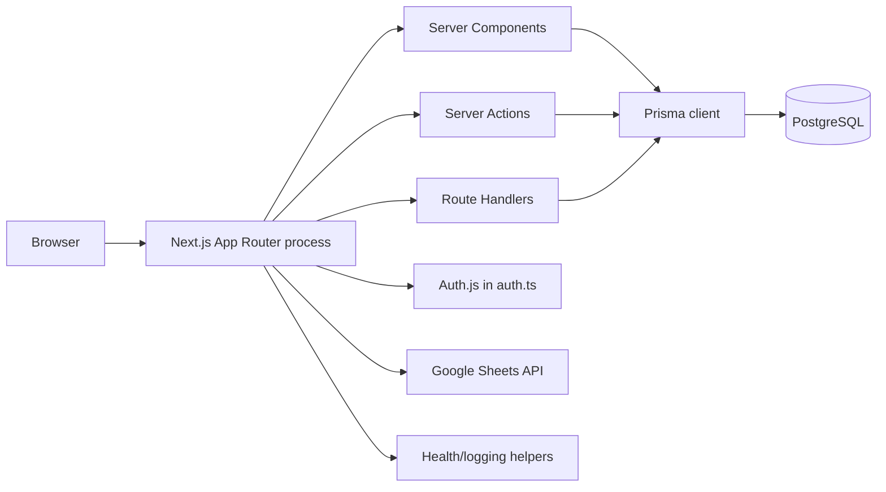
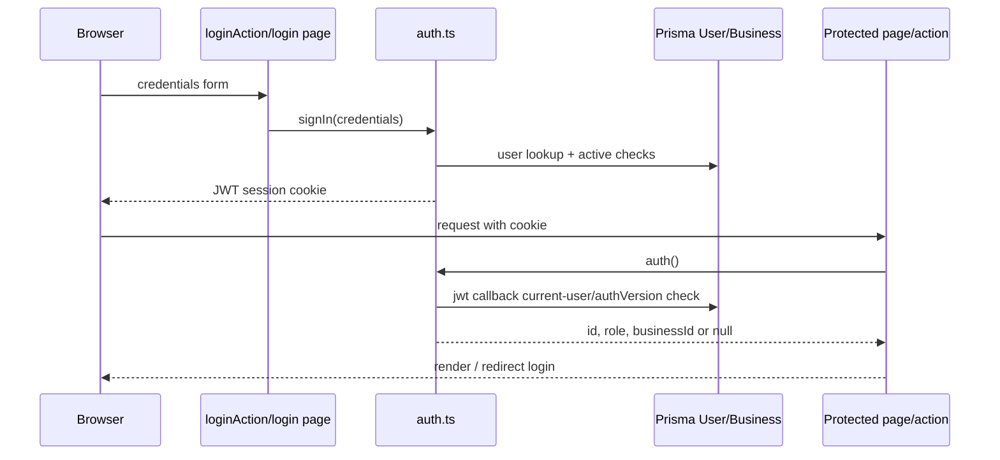
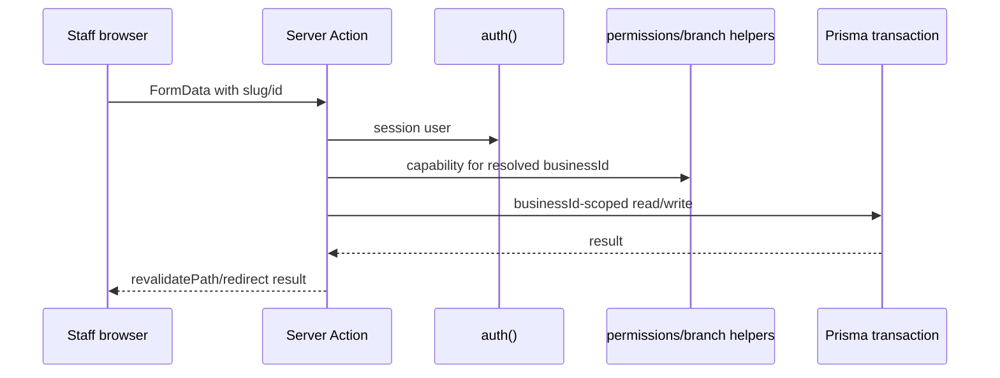
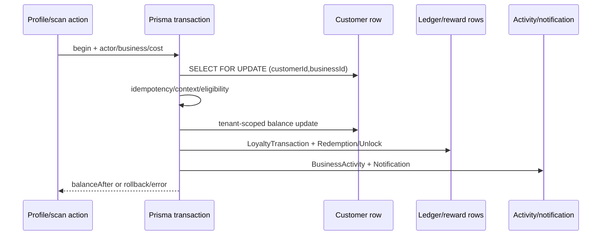
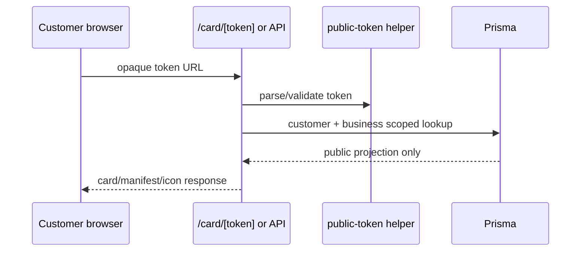
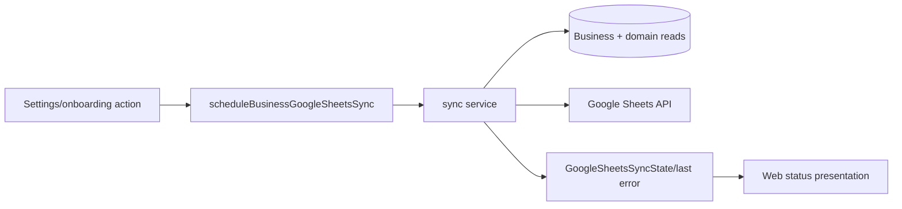
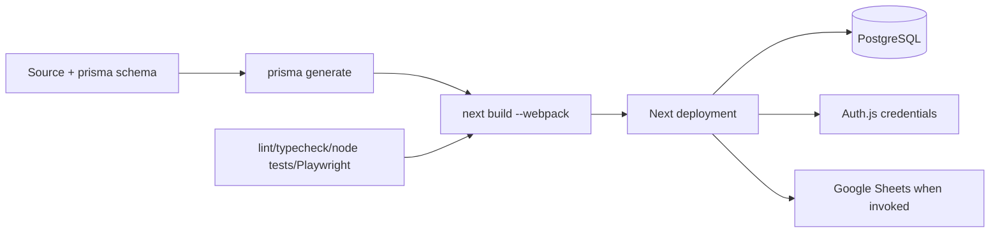

# Current-State Architecture — repository-grounded baseline

**Status: CONFIRMED current state** unless a row is labelled recommendation. This is a
map of the repository at `architecture/modernization-foundation-v1`, not a claim that
the proposed target already exists. Route-level contract detail is maintained in
[`docs/api/API_EXTRACTION_MATRIX.md`](../api/API_EXTRACTION_MATRIX.md); database
relations are maintained in [`docs/database/ERD_AND_DATA_DICTIONARY.md`](../database/ERD_AND_DATA_DICTIONARY.md).

## 1. Repository and runtime overview

| Concern | Confirmed implementation | Architectural consequence |
|---|---|---|
| Framework | Next.js `^16.2.10`, React `^19.2.4`; [`package.json`](../../package.json) | One App Router deployment contains pages, mutations and selected HTTP APIs. |
| Package manager | `pnpm` workspace root [`pnpm-workspace.yaml`](../../pnpm-workspace.yaml) | It is currently a single application package, not an application/package boundary. |
| Development/build | `dev: next dev`; `build: prisma generate && next build --webpack` in [`package.json`](../../package.json) | Development uses Turbopack by default; production build deliberately selects webpack. |
| Runtime boundaries | Server Components, Server Actions, and Route Handlers under [`app/`](../../app); client islands in [`components/`](../../components) | Prisma is reachable directly from all three server boundary types. |
| Database | Prisma 7 adapter for PostgreSQL in [`lib/prisma.ts`](../../lib/prisma.ts), schema in [`prisma/schema.prisma`](../../prisma/schema.prisma) | Transaction and tenant invariants are implemented in application code plus SQL migrations. |
| Authentication | Credentials-only Auth.js configuration in [`auth.ts`](../../auth.ts), handler [`app/api/auth/[...nextauth]/route.ts`](../../app/api/auth/[...nextauth]/route.ts) | Auth configuration and user lookup share the same web runtime and Prisma client. |
| Hosting assumption | Public origin validation in [`lib/public-app-url.ts`](../../lib/public-app-url.ts), production checks in [`lib/server/environment.ts`](../../lib/server/environment.ts) | Documentation and scripts assume a public HTTPS origin; no checked-in IaC/provider manifest proves a particular host. |
| External integration | Google Sheets client/configuration [`lib/google-sheets.ts`](../../lib/google-sheets.ts), scheduler [`lib/google-sheets-sync-scheduler.ts`](../../lib/google-sheets-sync-scheduler.ts) | Sync can be triggered from request-side code; it is not a separately deployed worker. |
| Observability | Structured helpers [`lib/server/logging.ts`](../../lib/server/logging.ts), health handlers [`app/api/health/route.ts`](../../app/api/health/route.ts) | Health and logging exist, but there is no repository-owned tracing pipeline. |
| Tests | Node test runner via `node --import tsx --test tests/*.test.ts`; Playwright config [`playwright.config.ts`](../../playwright.config.ts) | Pure/domain and static tests dominate; browser UAT is an explicit script, not evidence of a remote CI workflow. |

## 2. Route and rendering architecture

Pages are App Router files and are server-rendered by default unless their imported
component establishes a client boundary. The table records the controlling server
page/layout rather than every presentational child.

| Domain/group | Routes and shell | Auth / tenant source | Principal models | Major coupling |
|---|---|---|---|---|
| Root/public | [`app/page.tsx`](../../app/page.tsx), [`app/layout.tsx`](../../app/layout.tsx) | `auth()` only to choose `/dashboard` or `/login`; no tenant | `User` indirectly via session | Global layout, locale/theme and redirect policy. |
| Authentication | [`app/login/page.tsx`](../../app/login/page.tsx), [`app/login/actions.ts`](../../app/login/actions.ts) | Credentials → Auth.js | `User`, `Business` | Password comparison, rate limit and redirect are in `auth.ts`. |
| Onboarding | [`app/onboarding/page.tsx`](../../app/onboarding/page.tsx), `actions.ts` | `auth()` + owner role + `businessId` absence | `User`, `Business` | Creates/updates initial tenant data in the web action. |
| Platform administration | [`app/dashboard/page.tsx`](../../app/dashboard/page.tsx), [`app/operations/page.tsx`](../../app/operations/page.tsx), [`app/business-owners/page.tsx`](../../app/business-owners/page.tsx), [`app/plans/page.tsx`](../../app/plans/page.tsx) | `session.user.role === SUPER_ADMIN` | `Business`, `User`, `Customer`, ledger, plan config | Aggregate platform queries and billing administration are direct Prisma. |
| Business workspace | [`app/businesses/layout.tsx`](../../app/businesses/layout.tsx), all `app/businesses/[slug]/**` | Slug → `Business`; membership/role through permissions helpers | Business, customer, reward, transaction, branch and activity graph | Tenant resolution, permission checks, aggregation and presentation coexist in pages. |
| Customer/public card | [`app/card/[token]/page.tsx`](../../app/card/[token]/page.tsx), `api/card/*` | Opaque public token, not authenticated session | `Customer`, `Business`, `Reward`, `RewardUnlock` | Public DTO shaping and token validation live beside Prisma. |
| Join/enrolment | [`app/join/[slug]/page.tsx`](../../app/join/[slug]/page.tsx), `actions.ts` | Business slug is the tenant selector; anonymous request | `Business`, `Customer` | Public creation/throttling and tenant selection share a Server Action. |
| API handlers | [`app/api`](../../app/api) and report/customer/recovery export routes | Session/capability, public token, or health-specific boundary | Varies by handler | See API matrix; APIs are an incomplete second controller layer. |

### Workspace route domains

The `[slug]` workspace has server pages for activity, branches, campaigns, customers,
duplicates, offers, overview, playbooks, program, recovery, reports, staff reports,
rewards, scan, settings and users. Exact paths are visible in
[`app/businesses/[slug]`](../../app/businesses/[slug]). Export routes are co-located
under `customers/export`, `reports/export`, and `recovery/export`; that makes an HTTP
download a route concern but leaves it coupled to page-era tenant resolution.

## 3. Controller-like Server Components

These are high-impact server pages/layouts that read Prisma directly and therefore
behave like controllers. “Move” means move query orchestration behind an API/domain
boundary; the React composition and formatting remain web-owned.

| Exact path | Responsibility/models read | Permission and tenant source | API/domain work to extract | Web work retained |
|---|---|---|---|---|
| [`app/dashboard/page.tsx`](../../app/dashboard/page.tsx) | Platform or user dashboard; `User`, `Business`, `Customer`, `Branch`, `LoyaltyTransaction`, `RewardRedemption` | `auth()`, role switch; user `businessId` | dashboard summary/query service | cards, navigation, charts |
| [`app/operations/page.tsx`](../../app/operations/page.tsx) | Operations KPIs; users, businesses, ledger aggregates | `auth()` and explicit `SUPER_ADMIN` | platform analytics read API | operations layout |
| [`app/business-owners/page.tsx`](../../app/business-owners/page.tsx) | Owner/billing list; `User`, `Business`, billing fields | `auth()` + super-admin | administration query service | table/filter rendering |
| [`app/businesses/page.tsx`](../../app/businesses/page.tsx) | Tenant list/new-business entry; `Business`, `User` | session role/business membership | business discovery API | list and empty state |
| [`app/businesses/[slug]/page.tsx`](../../app/businesses/[slug]/page.tsx) | Business overview and KPI preparation | slug business + capability helpers | tenant dashboard DTO | overview components |
| [`app/businesses/[slug]/customers/page.tsx`](../../app/businesses/[slug]/customers/page.tsx) | Customer search/segments/list | slug/business predicate | customer-list query API | filters, table, copy |
| [`app/businesses/[slug]/customers/[customerId]/page.tsx`](../../app/businesses/[slug]/customers/[customerId]/page.tsx) | Profile, ledger, rewards, tags/notes | slug + customer business ownership | customer profile aggregate | profile sections |
| [`app/businesses/[slug]/reports/page.tsx`](../../app/businesses/[slug]/reports/page.tsx) | Date/range reports and presentation | tenant/branch access | report query service | chart and URL state |
| [`app/businesses/[slug]/reports/staff/page.tsx`](../../app/businesses/[slug]/reports/staff/page.tsx) | Staff performance aggregate | tenant and branch/staff filtering | staff report API | report rendering |
| [`app/businesses/[slug]/scan/page.tsx`](../../app/businesses/[slug]/scan/page.tsx) | Camera/manual search preparation | capability `LOYALTY_EARN` | scan bootstrap DTO | scanner and mobile UX |
| [`app/businesses/[slug]/scan/customer/[customerId]/page.tsx`](../../app/businesses/[slug]/scan/customer/[customerId]/page.tsx) | Earn/redeem target and unlock view | slug/customer ownership + capability | scan-customer aggregate | action controls/status |
| [`app/businesses/[slug]/settings/page.tsx`](../../app/businesses/[slug]/settings/page.tsx) | Business/profile/program/settings data | manager/owner permission | settings DTO | forms and copy |
| [`app/businesses/[slug]/branches/page.tsx`](../../app/businesses/[slug]/branches/page.tsx) | Branch/staff assignment model | business/manager predicate | branch management query API | branch UI |
| [`app/businesses/[slug]/rewards/page.tsx`](../../app/businesses/[slug]/rewards/page.tsx) | Reward catalogue/current state | tenant permission | reward query API | reward form/list |
| [`app/card/[token]/page.tsx`](../../app/card/[token]/page.tsx) | Public balance/card/reward projection | opaque token validation | public-card projection service | card composition/localization |
| [`app/join/[slug]/page.tsx`](../../app/join/[slug]/page.tsx) | Anonymous business enrollment presentation | slug and active business | public business projection | enrollment form/RTL presentation |

## 4. Server-action architecture

There are **18 action files and 54 exported actions** (inventory source:
`rg '^export async function' app --glob 'actions.ts'`). All execute in the web
deployment; action input is `FormData` or direct parameters, so their API contract is
implicit rather than independently versioned.

| File | Exported actions | Writes / transactional requirement | Permission + validation | Side effects / architectural problem |
|---|---|---|---|---|
| [`app/login/actions.ts`](../../app/login/actions.ts) | `loginAction` | Auth session only | Auth.js `signIn`; credentials schema in `auth.ts` | redirect query status; form endpoint is web-only. |
| [`app/onboarding/actions.ts`](../../app/onboarding/actions.ts) | `saveOwnerOnboardingAction`, `launchOwnerOnboardingAction` | `User`, `Business`; `$transaction` for launch | `auth()`, OWNER guard; onboarding checks | redirects, Google sync scheduling; workflow mixed with UI route. |
| [`app/language/actions.ts`](../../app/language/actions.ts) | `updateUserLanguageAction` | `User` | `auth()` and app-language validation | redirect; user preference protocol is not an API. |
| [`app/experience-mode/actions.ts`](../../app/experience-mode/actions.ts) | `updateExperienceModeAction` | `User` | session/role validation | redirect; preference mutation is action-specific. |
| [`app/dashboard/actions.ts`](../../app/dashboard/actions.ts) | `logoutAction` | Auth cookie/session | `signOut` | navigation side effect; belongs to auth adapter. |
| [`app/businesses/actions.ts`](../../app/businesses/actions.ts) | `createOwnerInvitationAction`, `createBusinessAction` | `User`, `Business` | super-admin/creation schemas | redirects; tenant provisioning in web process. |
| [`app/business-owners/actions.ts`](../../app/business-owners/actions.ts) | `updateBusinessBillingAction`, `recordBusinessPaymentAction`, `updateBusinessPlanAction`, `setBusinessPlatformStatusAction` | `Business` billing/status | local `requireSuperAdmin`, Zod/domain parsing | activity/redirect; duplicated super-admin controller logic. |
| [`app/plans/actions.ts`](../../app/plans/actions.ts) | `updatePlanLimitsAction` | `PlanConfiguration` | super-admin and plan validation | redirect; entitlement truth and platform UI coupled. |
| [`app/join/[slug]/actions.ts`](../../app/join/[slug]/actions.ts) | `joinBusinessAction` | `Customer` | active business/slug and input validation | public rate limit/redirect; anonymous write needs a stable API boundary. |
| [`app/businesses/[slug]/customers/actions.ts`](../../app/businesses/[slug]/customers/actions.ts) | `bulkCustomerAction`, `createCustomerAction` | `Customer`, tags/activities as applicable | tenant capability, Zod helpers | revalidate/redirect; bulk protocol implicit. |
| [`app/businesses/[slug]/customers/[customerId]/actions.ts`](../../app/businesses/[slug]/customers/[customerId]/actions.ts) | `updateCustomerAction`, `setCustomerStatusAction`, `adjustCustomerBalanceAction`, referral/tag/note actions, `addLoyaltyAction`, `redeemRewardAction` | Customer graph, ledger, unlock/redemption; financial paths use `$transaction` | `canPerform`; opaque IDs; domain services | revalidation/redirect; highest-risk controller/action concentration. |
| [`app/businesses/[slug]/branches/actions.ts`](../../app/businesses/[slug]/branches/actions.ts) | create/update/status/assign/remove | `Branch`, `BranchStaffAssignment`, activity | branch management helpers and tenant role | redirects; branch lifecycle action boundary. |
| [`app/businesses/[slug]/offers/actions.ts`](../../app/businesses/[slug]/offers/actions.ts) | create/update/toggle | `Offer` | tenant permission, offer validation | revalidate; CRUD remains web-owned. |
| [`app/businesses/[slug]/rewards/actions.ts`](../../app/businesses/[slug]/rewards/actions.ts) | create/update/toggle | `Reward` | tenant permission, reward validation | revalidate; reward policy mixed with form route. |
| [`app/businesses/[slug]/playbooks/actions.ts`](../../app/businesses/[slug]/playbooks/actions.ts) | `applyBusinessPlaybookAction` | `Business` | capability/playbook catalog | revalidate; catalog application needs domain service. |
| [`app/businesses/[slug]/settings/actions.ts`](../../app/businesses/[slug]/settings/actions.ts) | profile/program/messages/operations/card/sheet/export/delete actions | `Business`, user and sheet state; delete multi-model | role/entitlement/schema guards | sync and destructive mutation coexist in settings action module. |
| [`app/businesses/[slug]/users/actions.ts`](../../app/businesses/[slug]/users/actions.ts) | create/access/status/reset actions | `User`, branch access/activity | management permission/password policy | redirect; identity lifecycle needs auth-owned boundary. |
| [`app/businesses/[slug]/notification-actions.ts`](../../app/businesses/[slug]/notification-actions.ts) | mark read actions | notification read-state models | tenant/read-state assertions | revalidation; notification API absent. |

## 5. Direct Prisma access

**57 direct imports** of `@/lib/prisma` were counted using
`rg -l 'from "@/lib/prisma"' app components lib scripts tests` and classified by path:

| Category | Count | Representative paths | Why it matters |
|---|---:|---|---|
| App pages/layouts/actions/export routes | 44 | `app/dashboard/page.tsx`, `app/businesses/[slug]/customers/[customerId]/actions.ts`, `app/businesses/[slug]/reports/export/route.ts` | Presentation, write controllers, and download APIs share persistence knowledge. |
| API route handlers | 8 | `app/api/analytics/route.ts`, `app/api/card/[token]/route.ts`, `app/api/scan/resolve/route.ts` | An API layer exists but does not own all reads/writes. |
| Libraries/services | 3 | `lib/entitlements-server.ts`, `lib/google-sheets-sync-safe.ts`, `lib/notification-read-state.ts` | Some server services already provide extraction candidates. |
| Other (components/tooling/tests) | 2 | inspect inventory before moves; component imports are server-only or test support, not browser access | Must be eliminated from web-facing packages in target state. |

The count is an import-location measure, not a count of queries. It deliberately does
not imply every Prisma call is wrong; tenant-aware transaction services such as
[`lib/loyalty/transactions.ts`](../../lib/loyalty/transactions.ts) are appropriate
backend ownership candidates.

## 6. Auth and session flow

`auth.ts` configures `NextAuth` with `Credentials`, `session.strategy: "jwt"`, a
custom sign-in page, bcrypt comparison, and a request-address rate limiter. Its
`authorize` callback reads `User` including business activity; the `jwt` callback
re-reads the user, rejects inactive users/businesses and invalidated `authVersion`,
and its `session` callback exposes `id`, `role`, and `businessId`. The handler reuses
`handlers` in [`app/api/auth/[...nextauth]/route.ts`](../../app/api/auth/[...nextauth]/route.ts).

Cookie options are not overridden in `auth.ts`; their concrete name, `Secure`, host,
and SameSite behavior therefore follow installed Auth.js/NextAuth environment-sensitive
defaults. The repository validates `NEXT_PUBLIC_APP_URL` through
[`lib/public-app-url.ts`](../../lib/public-app-url.ts), but this file is not a proof
that a LAN IP and `localhost` share a session: browsers scope cookies by host, so they
are distinct origins. HTTPS production is required by production environment validation;
actual cookie behavior must be verified against the deployed origin. See the separate
auth/tenancy target document for future policy.

## 7. Tenant and permission flow

Tenant identity is usually the route slug resolving a `Business`, then an explicit
`businessId` condition on query/write. Capability evaluation comes from
[`lib/permissions.ts`](../../lib/permissions.ts), including `canAccessBusiness` and
`canPerform`; branch filtering is in [`lib/branches/access.ts`](../../lib/branches/access.ts),
and plan limits in [`lib/entitlements-server.ts`](../../lib/entitlements-server.ts).
The database additionally has composite tenant foreign keys introduced by
[`20260723044900_enforce_tenant_composite_foreign_keys`](../../prisma/migrations/20260723044900_enforce_tenant_composite_foreign_keys/migration.sql).

| Boundary | Enforcement observed | Residual coupling/risk |
|---|---|---|
| Business workspace | slug lookup + session role/capability + `businessId` query predicate | repeated resolution patterns can drift between pages/actions. |
| Branch | `canAccessBranch` / `canWriteAtBranch` and branch report filters | needs one backend authorization owner before API extraction. |
| Super admin | explicit `session.user.role === "SUPER_ADMIN"` in platform pages/actions | manual checks are distributed, e.g. `requireSuperAdmin` in business-owner actions. |
| Public card | opaque `publicToken` via [`lib/cards/public-token.ts`](../../lib/cards/public-token.ts) | token DTOs must remain deliberately minimal. |
| Scan | `canPerform(..., "LOYALTY_EARN")` and returned customer `businessId` equality in [`app/api/scan/resolve/route.ts`](../../app/api/scan/resolve/route.ts) | caller-provided business ID must always be compared, never trusted. |

## 8. Critical mutation flow: earn, redeem, adjustment and unlock

The profile and scan action entry points call the financial services in
[`lib/loyalty/transactions.ts`](../../lib/loyalty/transactions.ts):
`recordLoyaltyEarn`, `recordRewardRedemption`, and `recordBalanceAdjustment`.
They receive a transaction client and use `resolveFinancialOperationContext`, which
checks actor/capability/branch context. All three call `lockCustomerBalance`, a
`SELECT ... FOR UPDATE` scoped by customer and business; writes use `updateMany` with
tenant, active and (where needed) balance predicates. Earn/redemption/adjustment can
use a tenant-scoped idempotency key; conflicting replay throws a financial conflict.

| Operation | Ledger and balance | Reward/unlock | Audit/notification | Result |
|---|---|---|---|---|
| Earn | increments customer; creates `LoyaltyTransaction` type `EARN`; promotion application optional | reward eligibility is evaluated by caller/domain helpers | creates `BusinessActivity` and notification | returns `balanceAfter`, null, or typed conflict/context error |
| Redeem | decrements only if `balance >= cost`; creates negative `REDEEM` ledger and `RewardRedemption` | conditional `RewardUnlock.updateMany` marks `redeemedAt`; live unlock also requires expiry in future | activity and notification | atomic transaction must abort if unlock claim/balance race fails |
| Adjustment | signed update and `ADJUSTMENT` ledger | no unlock mutation | operation context/audit through service | preserves tenant lock/idempotency model |

The partial unique “one live unlock” index and expiry semantics are SQL migration
requirements, not merely Prisma model shape; see migration
[`20260720210000_add_reward_expiration`](../../prisma/migrations/20260720210000_add_reward_expiration/migration.sql).

## 9. Public-card and join flows

| Flow | Exact entry and validation | Reads/DTO | Privacy boundary |
|---|---|---|---|
| Card page | [`app/card/[token]/page.tsx`](../../app/card/[token]/page.tsx) and token helper | customer/business/card/reward projection | no session; only opaque token should authorize projection. |
| Card JSON | [`app/api/card/[token]/route.ts`](../../app/api/card/[token]/route.ts) | card serialisation | separate response contract must never expose staff-only fields. |
| Card assets | [`app/api/card-icon/[token]/route.tsx`](../../app/api/card-icon/[token]/route.tsx), `card-manifest` | icon/manifest metadata | token must be checked on each route, not inferred from browser navigation. |
| Join | [`app/join/[slug]/page.tsx`](../../app/join/[slug]/page.tsx) and `joinBusinessAction` | active `Business`, then `Customer` creation | slug is public tenant identity; do not return owner/staff data. |
| Scan resolve | [`app/api/scan/resolve/route.ts`](../../app/api/scan/resolve/route.ts) | public token → active customer/business | authenticated staff capability plus strict business ID equality. |

## 10. Integrations

| Integration | Confirmed files | Trigger/read/write | Retry/secrets/failure boundary |
|---|---|---|---|
| Google Sheets | [`lib/google-sheets.ts`](../../lib/google-sheets.ts), [`lib/google-sheets-sync.ts`](../../lib/google-sheets-sync.ts), [`lib/google-sheets-sync-safe.ts`](../../lib/google-sheets-sync-safe.ts), [`lib/google-sheets-sync-scheduler.ts`](../../lib/google-sheets-sync-scheduler.ts) | Business data is read from Prisma and sent through `googleapis`; settings/onboarding can schedule sync | configuration reads server env; safe wrapper records `GoogleSheetsSyncState`, last attempt/error/retryable fields. Scheduler is in-process, so no durable queue guarantee is established. |
| WhatsApp link/templates | [`lib/whatsapp-templates.ts`](../../lib/whatsapp-templates.ts) | template/render URL only | confirmed template construction, not a confirmed provider-side send or retry worker. |
| Card QR/image | [`lib/utils/qrcode.ts`](../../lib/utils/qrcode.ts), card handlers | locally generated/served presentation | no object-store integration is confirmed. |

## 11. Localization architecture

Language is represented by `AppLanguage` in [`prisma/schema.prisma`](../../prisma/schema.prisma)
and user preference is mutated by [`app/language/actions.ts`](../../app/language/actions.ts).
Copy is decentralised: examples include [`lib/reports/presentation.ts`](../../lib/reports/presentation.ts),
[`lib/customer-experience/public-copy.ts`](../../lib/customer-experience/public-copy.ts),
[`lib/cards/public-card-localization.ts`](../../lib/cards/public-card-localization.ts),
and domain `ui-copy.ts` helpers. Components also branch on language and contain Arabic
literals, including transactional messages in [`lib/loyalty/transactions.ts`](../../lib/loyalty/transactions.ts).
RTL/LTR rendering is handled by the app shell/layout and component CSS conventions,
not by a single catalog-backed i18n runtime. This is confirmed coupling, not a claim
that every visible string has an extraction candidate.

## 12. Build, test, and deployment flow

| Stage | Confirmed command/configuration | Boundary implication |
|---|---|---|
| Local dev | `pnpm dev` → `next dev` | Turbopack is the dev default; a development chunk issue does not prove production webpack failure. |
| Type/lint/unit | `pnpm typecheck`, `pnpm lint`, `pnpm test` | Node tests run `tests/*.test.ts` with `tsx`; they can validate pure extraction before API moves. |
| Browser | `pnpm test:browser-uat` with [`playwright.config.ts`](../../playwright.config.ts) | explicit browser suite needs a suitable running/seeded environment. |
| Production build | `pnpm build` → `prisma generate && next build --webpack` | generated Prisma client must be present before compilation. |
| Release checks | `release:check`, `release:production-preflight`, `release:final*` in [`package.json`](../../package.json) | scripts define gates; no checked-in CI workflow was found under `.github`. |

## 13. Confirmed coupling and technical debt

| Issue | Evidence/path | Operational impact | Future owner | Migration phase |
|---|---|---|---|---|
| Web owns persistence | 57 direct imports; `app/businesses/[slug]/**` | duplicate tenant/query policy and non-versioned read contracts | API + domain | Read extraction |
| Mutations are form contracts | 18 action files/54 exports | clients other than Next forms cannot safely consume the domain | API contracts | Write extraction |
| Financial policy is partly route-led | profile/scan actions + `lib/loyalty/transactions.ts` | accidental bypass risks ledger invariants | domain/ledger module | First protected writes |
| Distributed authorization | `auth.ts`, `lib/permissions.ts`, local action guards | drift across server components/actions/handlers | authz module | Foundation |
| Integration runs in web lifecycle | Google sync scheduler/service | latency/retry durability limited by request/runtime | worker integration module | Worker phase |
| Copy is dispersed | `lib/*copy*`, components, services | translation completeness and RTL review are hard to measure | web/i18n package | i18n phase |
| Public projection is duplicated | card page plus three card APIs | privacy/metadata contract can drift | public-card API | Public API phase |
| SQL-only invariants | reward-expiration partial index/composite FK migrations | schema-only refactors can silently weaken integrity | database owner | All DB phases |

### Current-state completion criteria

This document is complete when every future extraction begins by verifying the route or
symbol above against the API matrix and ERD; it does **not** authorize changing the
existing runtime, schema, migrations, or credentials.
