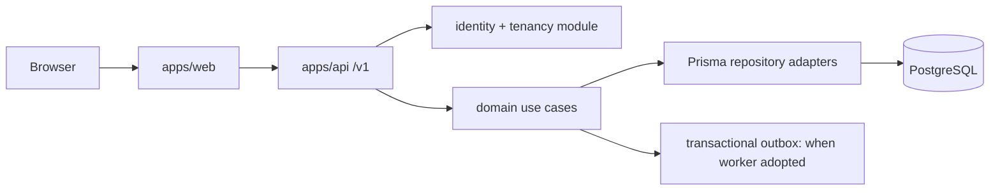
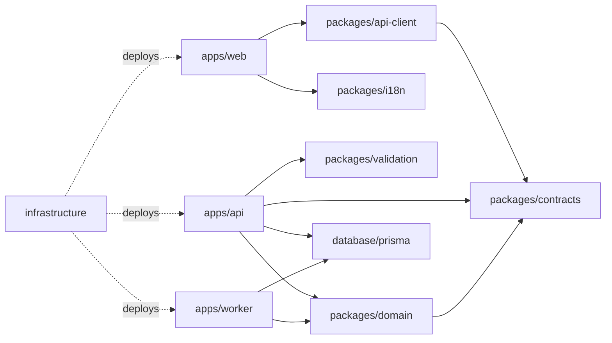
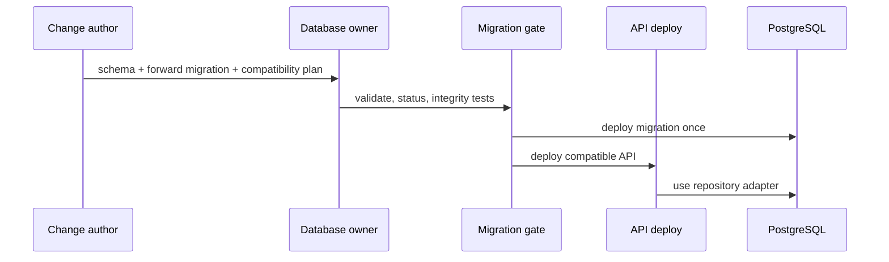
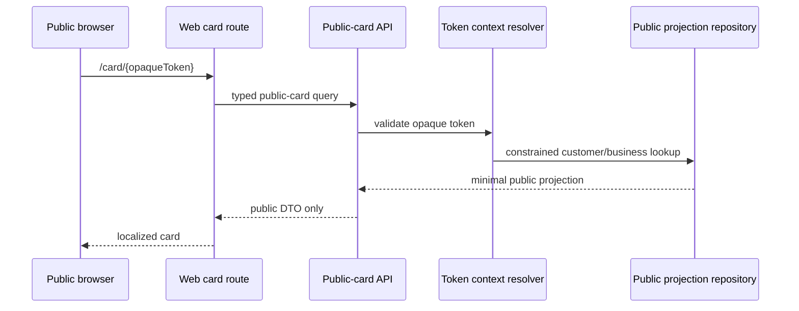
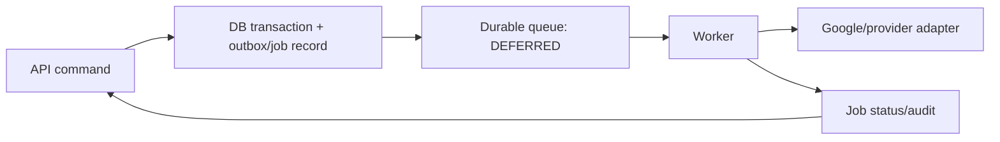
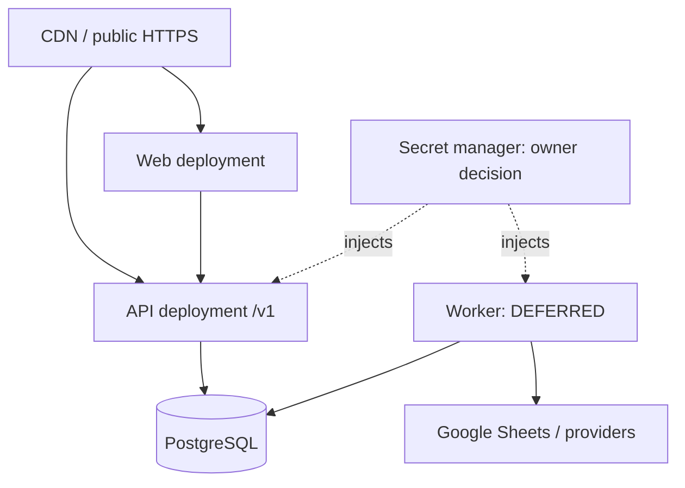
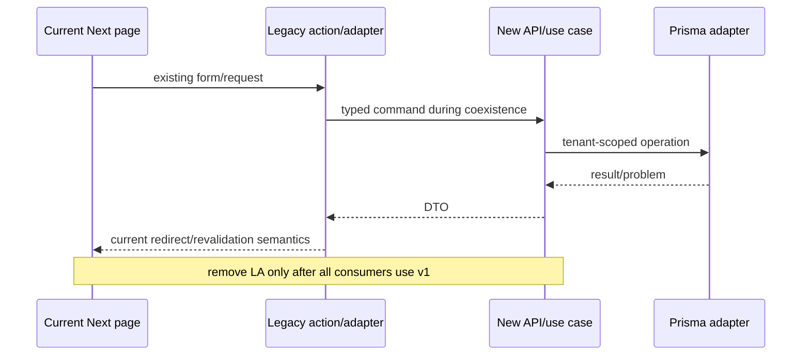

# Target Architecture — implementation contract

**RECOMMENDATION.** This target is deliberately incremental: the current Next
application remains the production system until each compatibility gate is met. It
does not propose a schema rewrite, an immediate repository split, or a replacement
authentication provider. Current routes/actions are enumerated in
[`API_EXTRACTION_MATRIX.md`](../api/API_EXTRACTION_MATRIX.md); current data ownership
is enumerated in [`ERD_AND_DATA_DICTIONARY.md`](../database/ERD_AND_DATA_DICTIONARY.md).

## 1. Architecture principles

| Principle | Implementation consequence | Label |
|---|---|---|
| One authoritative business operation | Earn, redeem, adjustment, enrollment and identity changes have one domain entry point, invoked by HTTP or legacy adapter. | RECOMMENDATION |
| Tenant is an input to every protected operation | API derives actor tenant context; repository queries require `businessId`; public access uses a separate token context. | RECOMMENDATION |
| Contracts are not Prisma models | DTOs are explicit and additive; database fields never leak by default. | RECOMMENDATION |
| Browser never owns secrets or persistence | `apps/web` has no Prisma, server database env, provider credential or financial write import. | RECOMMENDATION |
| Database invariants are preserved | Composite FKs, idempotency and reward-unlock partial index remain migration-owned and tested. | CONFIRMED constraint |
| Delivery is strangled, not forked | Move one read/write vertical slice behind compatibility adapters and delete only after parity. | RECOMMENDATION |
| Operational ownership is explicit | Every runtime has a deployer, secret owner, SLO/health check and test owner. | RECOMMENDATION |

## 2. Complete monorepo structure

```text
loyalflow/
  apps/
    web/                 # Next/React browser-facing application
    api/                 # versioned HTTP API + auth middleware
    worker/              # durable async consumers; absent until trigger met
  packages/
    domain/              # pure rules + application use cases/interfaces
    contracts/           # request/response DTOs, error codes, OpenAPI source
    validation/          # Zod boundary schemas derived from contracts
    i18n/                # message catalog, locale/RTL formatting
    config/              # typed non-secret config names/defaults
    api-client/          # generated typed browser/client bindings
    test-fixtures/       # non-production fixtures and contract test helpers
  database/
    prisma/              # schema, migrations, seed-free migration tooling
  infrastructure/        # CI/deploy/IaC only; provider choice is OWNER DECISION
  docs/
```

`apps/*` and `packages/*` are target directories, not files to create in this
documentation task. Until a package exists, its responsibility is represented by an
extraction module in the current repository with the same dependency constraints.

## 3. Responsibility table for every target app/package

| Target area | Responsibility | Permitted imports | Forbidden imports | Runtime/secrets/test/deploy owner | Phase |
|---|---|---|---|---|---|
| `apps/web` | routes, UI state, accessibility, rendering, API client | contracts, api-client, i18n, pure presentation/domain functions | Prisma, database env, server-only auth secrets, `googleapis` | Web team; public config only; component/E2E; web deploy | Web decoupling |
| `apps/api` | HTTP, session verification, authorization, DTO mapping | domain, contracts, validation, database client, observability | React/components, browser globals, direct web routes | Backend; server env; integration/API tests; API deploy | API foundation |
| `apps/worker` | scheduled/retried side effects | domain application ports, database, integration adapters | web, request/response state | Platform; provider secrets; job tests; worker deploy | DEFERRED |
| `packages/domain` | policies, use cases, repository/clock/event interfaces | TypeScript, contracts/value types | Next, React, Prisma concrete client, env, HTTP | Backend; no secrets; unit/property tests; published with API | Domain extraction |
| `packages/contracts` | DTOs, problem codes, pagination/version definitions | TypeScript/value types | Prisma model types, React, provider SDKs | API; no secrets; contract tests; package build | API foundation |
| `packages/validation` | parsing/normalisation at boundaries | Zod/contracts | Prisma calls, UI, env secrets | API/Web (browser-safe subset); validation tests | API foundation |
| `packages/i18n` | messages, locale formatting, direction metadata | ICU/formatting only | business write policy, Prisma, HTTP | Web; no secrets; locale snapshot tests | i18n phase |
| `packages/config` | typed config keys and safe parsing contracts | TypeScript/Zod | secret values in client exports, business services | Platform; config tests; package build | Foundation |
| `packages/api-client` | generated, versioned client | contracts, fetch transport | Prisma, React component imports | Web; no secrets; generation/contract tests | API foundation |
| `database/prisma` | schema, migrations, generated database adapter | Prisma tooling only | UI, HTTP handlers, provider SDKs | Database owner; migration integrity tests; DB release gate | Every DB-affecting phase |
| `infrastructure` | deployment, secrets references, CI, alarms | config metadata | application domain rules | Platform; deployment checks; infra deploy | Foundation |

## 4. Dependency direction

### A. Target runtime architecture





Dependency direction is inward: transport and UI call application/domain behaviour;
domain exposes ports; adapters implement those ports. `packages/domain` may share
value types with contracts but cannot depend on HTTP, Prisma or an environment.

## 5. Forbidden Import Matrix

| From \ To | web | api | worker | domain | contracts/validation | i18n | database/Prisma | provider SDK |
|---|---:|---:|---:|---:|---:|---:|---:|---:|
| web | — | HTTP/client only | no | pure only | yes | yes | **never** | **never** |
| api | no UI | — | queue contract only | yes | yes | formatting only | yes | adapter only |
| worker | no | API contract only | — | yes | yes | formatting only | yes | adapter only |
| domain | no | no | no | — | value types only | no | **never concrete** | **never** |
| contracts/validation | no | no | no | no business calls | — | no | **never** | no |
| i18n | UI formatting only | no | no | no | message types | — | **never** | no |
| database | no | no | no | no | no | no | — | no |

Violations fail lint/import-boundary checks before a migrated slice is accepted.
During coexistence, only a documented legacy adapter may call the old Prisma service;
that adapter remains server-only and has a deletion ticket.

## 6. Backend module boundaries

| Module | Owns | Public interface | Must not own | Initial source candidates |
|---|---|---|---|---|
| Identity/access | session actor, password lifecycle, authorization decisions | `ActorContext`, `authorize()` | browser redirect/presentation | [`auth.ts`](../../auth.ts), [`lib/permissions.ts`](../../lib/permissions.ts) |
| Tenancy | slug/public token → tenant context, branch scope | `TenantContext`, `PublicCardContext` | business UI data shaping | tenant predicates in workspace pages, [`lib/cards/public-token.ts`](../../lib/cards/public-token.ts) |
| Customers | profiles, tags, notes, status, search | customer DTO/use cases | financial arithmetic | customer actions/pages |
| Loyalty ledger | earn/redeem/adjust + idempotency | command/result/problem types | `FormData`, redirects, React | [`lib/loyalty/transactions.ts`](../../lib/loyalty/transactions.ts) |
| Rewards | catalogue, eligibility, unlock policy | reward/unlock DTOs | card visual design | [`lib/rewards`](../../lib/rewards) |
| Reporting | query filters, aggregates, exports | report DTO/cursor/export job request | chart rendering | [`lib/analytics`](../../lib/analytics) |
| Branch/staff | assignments/access/attribution | branch commands/read DTOs | dashboard UI | [`lib/branches`](../../lib/branches) |
| Platform admin | plans/billing/business status | admin-only contracts | tenant-facing UI | business-owner/plan actions |
| Integration | Google Sheets/event delivery ports | `SyncBusiness` job contract | HTTP/session ownership | google-sheets services |
| Notification/activity | audit and read state | event/audit append/query contracts | local page revalidation | [`lib/activity`](../../lib/activity), [`lib/notifications.ts`](../../lib/notifications.ts) |

Each module exposes application commands/queries and repository ports, not raw Prisma
delegates. A transaction boundary belongs to the use case; its repository adapter may
use Prisma’s transaction client.

## 7. Frontend module boundaries

| Frontend area | Owns | Receives | Must not do | Test owner |
|---|---|---|---|---|
| Shell/navigation | layout, navigation, locale direction | session-safe identity DTO | query Prisma / decide capability truth | web component tests |
| Workspace screens | query state, forms, loading/error UI | API DTOs/problem codes | trust hidden business ID / compute ledger | web + E2E |
| Scanner | camera UX, scan input | scan bootstrap/resolve responses | directly mutate balance | device-focused E2E |
| Public card/join | token URL UX, privacy-safe display | public-card/join DTO only | infer staff or internal metadata | privacy contract + E2E |
| Presentation/i18n | formatting/cards/charts/RTL | primitive/DTO values and messages | choose reward eligibility or locale persistence policy | snapshots/accessibility |

## 8. Domain package rules

1. Domain functions accept typed input and injected ports (`clock`, repository,
   notification/event publisher); they do not read `process.env`, cookies, `FormData`,
   or request headers.
2. A financial command contains `businessId`, `customerId`, actor/branch attribution,
   idempotency key where applicable, and an operation origin. It cannot accept a
   caller-supplied `balanceAfter`.
3. Domain throws or returns stable problem codes; HTTP and Server Actions map those
   problems to status/redirect UI respectively.
4. The Prisma adapter preserves `FOR UPDATE`, conditional updates, composite tenant
   predicates, and the partial live-unlock index. Reimplementation without those
   properties is a failed migration.

## 9. Contract and validation rules

| Rule | Required implementation | Owner |
|---|---|---|
| Version | `/v1` prefix for externally consumable API; internal legacy adapter is unversioned only during migration | API |
| Inputs | Zod validation at HTTP/action boundary, normalization once | validation/API |
| Outputs | explicit success DTO and problem DTO; never serialize Prisma entity directly | API/contracts |
| Pagination | cursor + stable sort + tenant filter for all unbounded lists | API/domain |
| Dates/money | ISO 8601 strings and documented whole-number/minor-unit semantics; no locale-formatted numeric API fields | contracts |
| Errors | machine code, safe message, request/correlation ID where available | API/observability |
| Compatibility | additive fields first; consumer migration/telemetry; deprecated field removal only after gate | API/web |

## 10. Database/Prisma ownership

Database ownership is exclusive to `database/prisma` and backend repository adapters.
Web never imports generated Prisma types as DTOs. The database owner reviews every
migration against the baseline inventory, especially the tenant composite-FK migration
and reward-expiration partial index. Prisma generation runs in API/worker build images;
the web build cannot require database credentials. Migration deployment is a separate,
ordered release operation with backup/rollback assessment, never an application startup
side effect.



## 11. Auth and tenancy ownership

`apps/api` owns session verification and creates immutable request-scoped `ActorContext`.
The tenancy module resolves exactly one of: authenticated business context,
super-admin platform context, or public-card context. A handler never accepts a
business ID as authority; it may accept it as a selector only after matching it to
actor membership/capability. Slug and public-token lookups are backend reads, not
client-trusted context. Secret material (Auth.js secret, database URL, Google service
credentials) is server/worker-only; browser configuration contains only public origin
and non-sensitive feature flags.

### C. Authenticated API flow

```mermaid
sequenceDiagram
  participant B as Browser/web
  participant A as API middleware
  participant I as Identity + tenancy
  participant U as Domain use case
  participant R as Prisma repository
  B->>A: /v1/businesses/{slug}/... + session
  A->>I: verify session; resolve actor and business
  I-->>A: immutable ActorContext/TenantContext
  A->>U: validated command/query + contexts
  U->>R: mandatory businessId predicate
  R-->>U: DTO data/result
  U-->>A: success or stable problem
  A-->>B: versioned DTO/status
```

### D. Public-card flow



## 12. API versioning, deprecation, and typed clients

`/v1` begins with read endpoints whose payloads are defined in `packages/contracts`.
OpenAPI or equivalent machine-readable contract is generated/validated in CI, then
produces `packages/api-client`. The web consumes only the generated client or a thin
wrapper. Deprecation requires: replacement field/endpoint, consumer migration,
contract tests, production usage evidence, a published removal date, and deletion of
the legacy adapter. A Server Action remains only as an adapter calling the same domain
use case until the web has switched.

## 13. Background jobs, storage, cache, and queue criteria

| Capability | Initial target | Introduce only when | Not an excuse to do |
|---|---|---|---|
| Worker/jobs | API-owned worker consuming durable job records | Google Sheets or notifications require retry beyond request lifetime, scheduled expiry, or jobs exceed latency budget | moving ledger mutation out of its transaction without idempotency |
| Object storage | provider-neutral `ObjectStore` port | user-upload/card assets cannot safely remain data URLs/request memory or need lifecycle/virus controls | exposing signed provider credentials to web |
| Redis/cache | cache/rate-limit port | measured hot reads/rate-limit needs exceed process-local behaviour and invalidation strategy exists | caching tenant data without tenant key/isolation |
| Queue | durable queue adapter | at-least-once delivery, retry/backoff, dead-letter and monitoring requirements are accepted | claiming a timer in a web process is durable |

The current Google Sheets state columns are the starting observability record; a job
must carry a business-scoped idempotency key and record attempts/result safely.



## 14. Observability, deployment and scaling boundaries

| Boundary | Target owner | Required signal/guard | Phase |
|---|---|---|---|
| HTTP API | API | request ID, safe error, tenant-safe logs, latency/error rate | API foundation |
| Ledger | domain/database | idempotency conflict, lock/conditional-write failure, audit event | first financial API |
| Worker | platform/integration | queue age, retries, dead letters, provider failures | DEFERRED |
| Public card | API/web | token failure rate without logging tokens, response contract tests | public-card phase |
| Database | database owner | migration status, backup/recovery objective, query/index review | all phases |
| Web | web | client error/navigation/load telemetry subject to privacy decision | OWNER DECISION |

Web, API and worker are independently deployable only after their contracts and
environment manifests are independent. Before then, a single deployment may contain
both Next legacy routes and API modules, but runtime ownership must still be separated.
Scale web horizontally for render load; scale API for requests; scale workers by queue
depth. Database connection pooling, rate-limit storage, and regional topology are
**OWNER DECISION** after measured demand rather than a documentation-driven change.



## 15. Strangler coexistence and deletion conditions

| Current component | Target owner | Transition | Delete legacy only when |
|---|---|---|---|
| Direct server-page Prisma reads | API query + domain repository | page calls typed client/route adapter behind parity flag | data/permission/locale parity and route-level tests pass |
| `app/**/actions.ts` CRUD | API command + domain use case | action calls API/domain adapter; then form uses client | no form/action import remains and contract tests cover errors |
| `lib/loyalty/transactions.ts` | domain application service + Prisma adapter | preserve service semantics, move transport callers first | lock/idempotency/concurrency and ledger golden tests pass |
| Auth.js calls in pages | API identity/SSR adapter | retain provider initially, centralise actor context | session invalidation and role transitions pass browser tests |
| Google Sheets scheduler | worker integration adapter | outbox/job bridge with current state mapping | retries/dedup/observability production gate passes |
| Public card page/API duplication | public-card module | one projection service feeds both | privacy DTO contract and token tests pass |



Legacy deletion requires a named owner, no live callers (repository search + telemetry
where available), contract/authorization/financial tests, rollback evidence, and a
release note. A new API endpoint is not itself a deletion condition.

## 16. Security invariants

1. Every protected repository predicate contains the resolved `businessId`; cross-
   tenant IDs return non-disclosing failure.
2. Capability is evaluated server-side from current identity, not only JWT hints or
   client route state.
3. Public tokens authorize only a deliberately minimal public projection; never log
   raw tokens or put staff data into public card DTOs.
4. Credentials, database URLs, and provider private keys never enter `apps/web` or
   generated API clients.
5. Financial operations preserve database lock, tenant conditional update,
   idempotency conflict detection, immutable ledger semantics and audit event.
6. Background work is idempotent and business-scoped; retries cannot duplicate a
   provider action or alter a ledger.
7. Schema/migration changes retain composite tenant FKs and partial-index semantics.

## 17. Ownership matrices

### Secrets ownership

| Secret/config class | Web | API | Worker | Database/migration | Owner |
|---|---:|---:|---:|---:|---|
| Public app origin | public-safe | read | read if links needed | no | platform |
| Auth secret/credential policy | no | yes | no | no | identity |
| Database connection | no | yes | yes | migration-only credential | database/platform |
| Google credential | no | adapter only | yes when worker exists | no | integration/platform |
| Feature flags | public subset | server truth | server truth | no | product/platform |

### Testing ownership

| Test type | Owner | Required evidence |
|---|---|---|
| Domain unit/concurrency | domain/backend | ledger lock/idempotency/reward unlock invariants |
| API contract/authz | API | valid, invalid, cross-tenant and role matrix |
| Prisma migration/integrity | database | upgrade, indexes/composite FKs, rollback assessment |
| Web accessibility/i18n | web | RTL/LTR, keyboard, responsive, problem rendering |
| End-to-end | web + API | login, business scope, earn/redeem, public card/join |
| Job/provider | integration | retries, duplicate delivery, secret absence from logs |

### Deployment ownership

| Deployable | Owner | Gate | Rollback |
|---|---|---|---|
| Web | web | typed-client compatibility, E2E smoke | previous web artifact |
| API | backend | contract/authz/domain tests | compatible previous API |
| Worker | platform/integration | idempotency/retry/queue health | pause consumer, replay safely |
| Migration | database | forward compatibility + backup/recovery review | explicit forward-fix or approved rollback plan |

## 18. Monorepo and multi-repository criteria

Remain a monorepo while atomic contracts/migrations, one delivery team, and shared
tooling reduce risk. Consider multi-repository only when API contracts are stable and
versioned, web/API have independent release cadence and ownership, CI/publishing/secret
management are mature, and the operational cost of cross-repo coordination is lower
than the benefit. This is an **OWNER DECISION**, not a prerequisite for API extraction.

## 19. Definition of architecture completion

Architecture completion means all target constraints are demonstrably true, not that
a folder tree exists:

- Web has zero direct Prisma/server-secret imports and uses versioned typed contracts.
- Each current high-risk action has one API/domain operation with tenant/authz and
  parity tests; legacy adapters are deleted by the stated conditions.
- Database ownership and migration gates preserve current integrity invariants.
- Public card, scanner, and join flows have explicit privacy-safe contracts.
- Integration side effects are durable or explicitly remain synchronous with accepted
  bounded behaviour; then documented scaling triggers decide worker/cache/queue work.
- Owners can independently test, deploy, observe and roll back web, API, database and
  worker responsibilities.

Until those criteria are met, this target remains a migration plan, not a description
of the running system.
