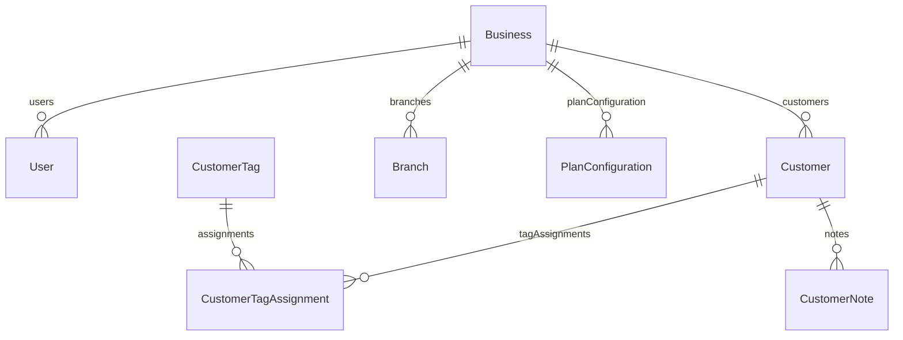
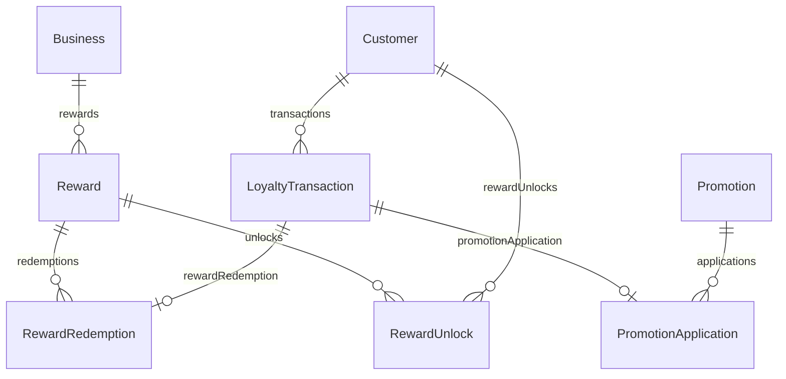
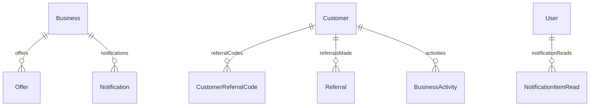
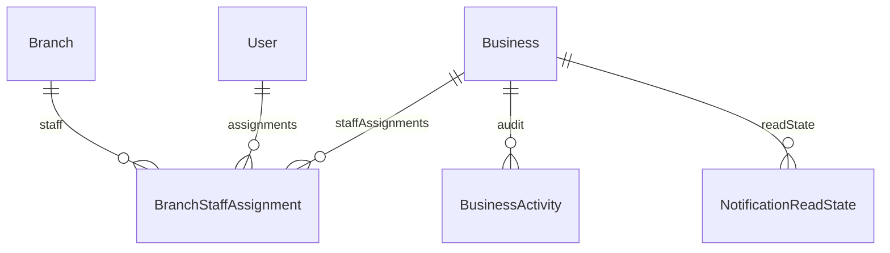

# ERD and Data Dictionary

## CONFIRMED inventory
`prisma/schema.prisma` defines **22 models** and **18 enums**. Prisma model declarations and SQL migrations are both authoritative; migrations additionally contain partial indexes and composite foreign keys Prisma cannot fully represent.

## Tenant and identity ERD

## Loyalty and rewards ERD

## Growth and messaging ERD

## Operations, billing, integration and audit ERD

## Model dictionary
| Model | CONFIRMED purpose / ownership / lifecycle | Keys, relations, scaling, risk |
|---|---|---|
| Business | Tenant root; written by `app/businesses/actions.ts`, settings, billing owner actions. | `id` PK; `slug` unique; owns tenant relations; currency/unit/rewardThreshold are operational values; cascade root. |
| PlanConfiguration | Platform plan limit/configuration. | Plan-keyed configuration; owner: `app/plans/actions.ts`; entitlement-sensitive. |
| User | Authenticated staff/owner identity. | `id`, email uniqueness; `businessId` tenant relation; password/hash/email are sensitive; writes in users/onboarding/auth actions. |
| Customer | Tenant CRM and loyalty balance. | `id`; unique `(businessId,phone)` and `(businessId,customerCode)`; PII phone/name, balance/lifetime snapshots; actions under customers. |
| CustomerTag | Tenant-owned CRM tag. | unique `(businessId,name)`; tag assignments cascade through tenant relationship. |
| CustomerTagAssignment | Customer↔tag join. | unique `(customerId,tagId)`; composite tenant FKs established by migration `20260723044900_enforce_tenant_composite_foreign_keys`. |
| CustomerNote | Staff-authored CRM history. | content sensitive; created/updated actor relations; notes actions own writes. |
| Reward | Tenant catalogue reward. | cost/expiresAfterDays/isActive; reward actions own writes; costs are integer loyalty units. |
| Offer | Customer-facing offer, independent of balance. | validity/eligibility lifecycle; offers actions own writes. |
| LoyaltyTransaction | Immutable operational ledger record. | `amount`, `balanceAfter`, `saleAmount`, idempotency key; only `lib/loyalty/transactions.ts` should write; critical historical retention. |
| Branch | Tenant business location. | branch actions own writes; active lifecycle. |
| BranchStaffAssignment | User↔branch join. | composite tenant relations; branch assignment actions own writes. |
| Promotion | Tenant earning promotion. | active/time/mode/minimum/bonus fields; promotion engine reads it. |
| PromotionApplication | Historical promotion applied to one earn transaction. | transaction relation; snapshot-like base/bonus values; ledger relevance. |
| RewardRedemption | Historical redemption snapshot. | rewardName/cost plus optional reward/transaction relation; created in `recordRewardRedemption`. |
| RewardUnlock | Expiring reward entitlement history. | `expiresAt` required, redeemed/expired nullable; partial unique live `(customerId,rewardId)` index exists only in migration SQL. |
| CustomerReferralCode | Tenant customer referral identity. | unique tenant/customer and tenant/code; code is public-facing secret-like identifier. |
| Referral | Referrer/referred customer relationship. | unique `(businessId,referredCustomerId)`; historical referral state. |
| BusinessActivity | Tenant audit/event log. | description/metadata/IP/device can be sensitive; append-only application convention. |
| Notification | Tenant operational notification. | optional user recipient; notification actions mutate read state indirectly. |
| NotificationReadState | Per-user/business read watermark. | read-state lifecycle; notification actions own writes. |
| NotificationItemRead | Per-user notification item read state. | unique/read tracking; notification actions own writes. |

All tenant operational models use `businessId`; deletion behavior is declared in relations and strengthened for customer/reward child relations by the composite-FK migration. **INFERENCE:** retained ledger/audit/redemption/unlock records should be treated as historical and never bulk-deleted without owner approval. PostgreSQL portability concern: partial indexes, enum alterations, and composite FKs must be replayed/tested on any provider.

## Enum dictionary
| Enum | Values / current use | Compatibility concern |
|---|---|---|
| GoogleSheetsSyncState | integration sync status | persisted integration state |
| CardDesignMode | STANDARD, CUSTOM | public-card rendering contract |
| OwnerOnboardingStatus | onboarding lifecycle | persisted workflow |
| ThemePreset, ButtonStyle, CardLayout | business card/theme fields | UI compatibility |
| UserRole, ExperienceAccess, AppLanguage | User authorization/experience/locale | API/session/export compatibility |
| LoyaltyMode | VISITS, POINTS, SALES_AMOUNT | ledger/presentation semantics |
| BillingInterval, PaymentStatus, SubscriptionPlan | billing and entitlement state | externally operational |
| OfferEligibility | offer audience | customer visibility |
| TransactionType | EARN, REDEEM, ADJUSTMENT | ledger/export compatibility |
| ActivityType | audit event codes | migrations add values; never reorder/remove |
| ReferralStatus | referral lifecycle | historical reporting |
| RewardType | GIFT, PROMO_CODE, DISCOUNT, CUSTOM | reward/card/public presentation |

## Database ownership after separation
Identity/Auth owns User; Businesses/Tenancy owns Business/Branch/PlanConfiguration; Customers/CRM owns Customer/tags/notes/referrals; Loyalty Ledger owns LoyaltyTransaction/PromotionApplication; Rewards owns Reward/RewardRedemption/RewardUnlock; Growth owns Offer/Promotion; Billing owns subscription fields; Integrations owns Google sync state; Audit/Notifications owns BusinessActivity/Notification/read models. This is a **RECOMMENDATION**, not a schema redesign.
