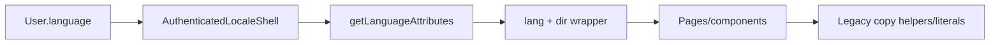
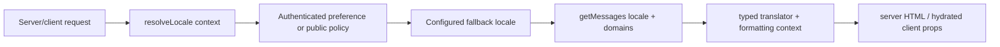
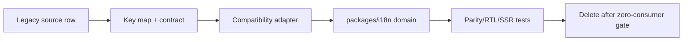
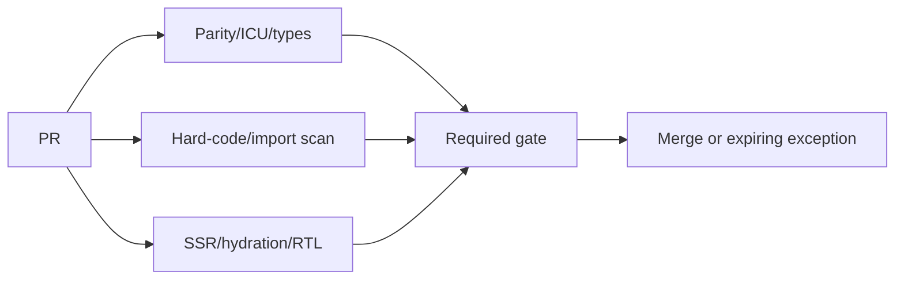
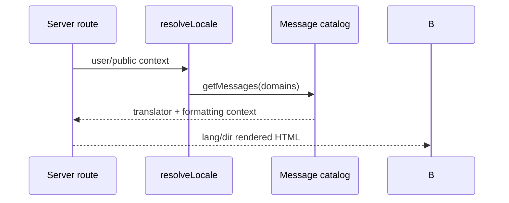
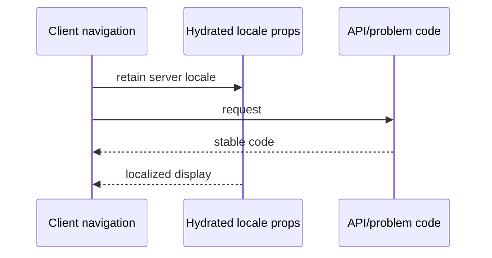
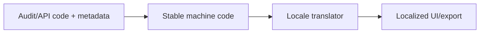

# Repository-grounded i18n Migration Plan

**Scope:** documentation only. **CONFIRMED** claims name a repository path/symbol;
target architecture is **RECOMMENDATION** or **OWNER DECISION**. This plan complements
the web/API boundaries in [`TARGET_ARCHITECTURE.md`](../architecture/TARGET_ARCHITECTURE.md).

## A. Current localization inventory — CONFIRMED

The inventory uses the 47 files below: source modules whose primary purpose is copy,
language/direction, formatting/presentation, or a user-facing page/component with
explicit AR/EN/language branching. It was independently derived with a repository
search for language branches, Arabic literals, `Intl`, `dir`, and copy/presentation
filenames. It does not pretend every hard-coded string in every UI file is a dictionary.

| # | Exact source | Type/domain/symbol | Coverage/consumer/runtime | Locale/RTL/interpolation/format | Target/phase/risk/test |
|---:|---|---|---|---|---|
| 1 | `lib/i18n.ts` | language runtime; `getLanguageAttributes`, `sharedDictionary` | AR/EN; shell/shared; server+client | user `language`; `rtl/ltr`; no plural | `runtime`; foundation; H; direction/unit |
| 2 | `components/authenticated-locale-shell.tsx` | authenticated locale shell | app workspace; server | User.language → `lang`,`dir`; fallback AR | runtime; foundation; H; SSR/hydration |
| 3 | `app/language/actions.ts` | preference action | authenticated; server | `isAppLanguage`; DB persistence; no copy | runtime; foundation; M; action test |
| 4 | `components/language-switcher.tsx` | language UI | authenticated client | AR/EN labels; form action | common/navigation; common; M; a11y |
| 5 | `app/layout.tsx` | root metadata/layout | global server | fixed `lang="en"`; English SEO | metadata/common; foundation; H; SSR |
| 6 | `lib/customer-experience/public-copy.ts` | public-card dictionary | public AR/EN; shared | function copy; interpolation; no ICU | public-card; public; H; key parity |
| 7 | `lib/cards/public-card-localization.ts` | card localisation adapter | public card; shared | locale/date labels | public-card; public; M; formatting |
| 8 | `lib/customers/ui-copy.ts` | customer dictionary | AR/EN; customer pages | functions/interpolation; manual plurals | customers; customers; H; parity |
| 9 | `lib/growth/ui-copy.ts` | growth dictionary | AR/EN; growth UI | dictionary lookup | growth; growth; M; parity |
| 10 | `lib/scan/copy.ts` | scanner dictionary | AR/EN; scan UI | statuses/interpolation | loyalty; loyalty; H; device UI |
| 11 | `lib/reports/presentation.ts` | reports copy/format | AR/EN; reports | date/range text, safe number | reports; reports; M; UTC/format |
| 12 | `lib/activity/presentation.ts` | audit label presentation | activity UI; shared | enum labels/badges | common/audit; templates; H; enum labels |
| 13 | `lib/whatsapp-templates.ts` | communication templates | business messages; server | user text variables; Arabic defaults | communications; templates; H; escaping |
| 14 | `lib/billing/subscription.ts` | billing formatting | admin/platform; shared | money/date interval labels | admin; admin; M; currency |
| 15 | `lib/cards/standard-card.ts` | card unit/presentation | public/workspace; shared | unit compacting; AR literals | public-card/loyalty; loyalty; H; visual |
| 16 | `lib/theme.ts` | card theme labels | card UI; shared | presentation branches | public-card; public; L; snapshot |
| 17 | `lib/campaigns/builder.ts` | campaign default copy | growth; shared | English/Arabic templates | growth; growth; M; interpolation |
| 18 | `lib/campaigns/suggestions.ts` | campaign messages | growth; shared | language input/messages | growth; growth; M; parity |
| 19 | `lib/campaigns/winback.ts` | win-back template | growth; server/shared | template interpolation | communications/growth; templates; H; content review |
| 20 | `lib/playbooks/catalog.ts` | playbook catalog copy | workspace; shared | embedded labels/descriptions | businesses; shell; M; product review |
| 21 | `lib/onboarding/countries.ts` | country labels | onboarding; shared | country names/user selection | common; onboarding; M; locale policy |
| 22 | `lib/onboarding/country-search.ts` | country search normalisation | onboarding; shared | multilingual search text | common; onboarding; L; search unit |
| 23 | `lib/onboarding/owner-onboarding-validation.ts` | validation messages | onboarding; shared | Zod errors | validation; validation; H; error mapping |
| 24 | `lib/business/domain-validation.ts` | business validation | settings/actions | Zod messages | validation; validation; H; API mapping |
| 25 | `lib/business/settings-domains.ts` | settings validation | business settings | Zod/Arabic literals | validation/settings; settings; H; forms |
| 26 | `lib/business/creation-input.ts` | create-business validation | admin server | Zod password/config copy | validation/admin; admin; H; action test |
| 27 | `lib/auth/password-policy.ts` | password errors | login/users; shared | Zod message path | validation/auth; auth; H; form errors |
| 28 | `lib/loyalty/transactions.ts` | ledger activity text | server mutation | Arabic audit/notification strings | loyalty/audit; loyalty; H; no business logic move |
| 29 | `lib/notifications.ts` | notification presentation | server/shared | title/message inputs | common/audit; templates; M; DTO test |
| 30 | `lib/business/onboarding.ts` | setup state labels | dashboard; shared | status presentation | businesses; shell; M; state test |
| 31 | `lib/dashboard/overview.ts` | dashboard labels/actions | dashboard; shared | mode/shortcut copy | dashboard; dashboard; M; UI |
| 32 | `lib/app-shell-navigation.ts` | navigation labels | shell; shared | role/language branches | navigation; common; H; RTL/nav |
| 33 | `lib/administration/navigation.ts` | admin nav labels | platform; shared | capability-driven labels | admin/navigation; admin; M; role matrix |
| 34 | `app/login/page.tsx` | auth page literals | unauthenticated server | English fields/a11y | auth; auth; H; login matrix |
| 35 | `app/onboarding/page.tsx` | onboarding presentation | owner server | literals/locale via components | businesses; shell; M; SSR |
| 36 | `app/businesses/[slug]/customers/page.tsx` | customer page literals | tenant server | `language` branches + ui-copy | customers; customers; H; role/RTL |
| 37 | `app/businesses/[slug]/customers/[customerId]/page.tsx` | profile presentation | tenant server | copy + dates/amounts | customers/loyalty; customers; H; privacy |
| 38 | `app/businesses/[slug]/reports/page.tsx` | report copy | tenant server | `reportCopy`, Intl/path | reports; reports; M; dates |
| 39 | `app/businesses/[slug]/reports/export/route.ts` | CSV labels | tenant route | language/business units | reports; reports; H; CSV snapshots |
| 40 | `app/businesses/[slug]/scan/page.tsx` | scanner shell | tenant server | scan copy/language | loyalty; loyalty; M; mobile RTL |
| 41 | `app/businesses/[slug]/scan/customer/[customerId]/page.tsx` | earn/redeem display | tenant server | reward/progress strings | loyalty/rewards; loyalty; H; action states |
| 42 | `app/businesses/[slug]/settings/page.tsx` | settings copy | tenant server | form labels/messages | settings; settings; H; a11y |
| 43 | `app/businesses/[slug]/users/page.tsx` | staff/password UI | tenant server | English/Arabic form labels | settings/admin; settings; H; validation |
| 44 | `app/card/[token]/page.tsx` | public card page | public server | card localization, dates | public-card; public; H; privacy/RTL |
| 45 | `app/join/[slug]/page.tsx` | enrollment page | public server | business language/public literals | public-card; public; H; join matrix |
| 46 | `components/customer-experience/public-page-shell.tsx` | public layout | public client/shared | direction/layout | public-card/runtime; public; M; bidi visual |
| 47 | `components/business-notifications-content.tsx` | notification UI | authenticated client | activity labels/dates | common/audit; templates; M; hydration |

“User-generated content risk” applies to business names, customer names, reward names,
messages, notes and codes flowing through these surfaces: they are data, not translation
keys; render safely and use `dir="auto"` when free text is displayed.

## B. Current language ownership

| Surface | Current source/fallback/persistence | Server/client/mismatch | Target owner |
|---|---|---|---|
| Authenticated app | `User.language` in locale shell; `normalizeLanguage` fallback AR | server derives wrapper; client islands receive prop; root HTML remains EN | runtime/web |
| Login/auth | fixed English literals in `app/login/page.tsx` | server; no persisted public locale confirmed | auth/web |
| Business workspace | page reads user/business data and passes `language`/copy helpers | server data + client props; inconsistent hard-coded strings risk | web/i18n |
| Platform admin | roles/pages plus local literals | server; no central admin catalog | admin domain |
| Public card | card/business fields and public copy helpers | server page/API projection; no customer locale preference confirmed | public-card |
| Join | business slug page/action | public server; language ownership requires decision | public-card |
| Communications | templates/business content | server; user-generated content may be mixed language | communications |
| Audit/activity | `activity/presentation` plus stored descriptions | shared; historic stored text cannot be translated reliably | audit owner |
| Exports/reports | report helper and route language/business metadata | server/CSV; locale formatting must be deterministic | reports |
| Errors/API | Zod/action redirect text and route JSON codes | server; API display localization incomplete | contracts/i18n |
| Metadata/SEO | fixed root metadata | server; document locale mismatch | web/owner decision |

**CONFIRMED:** authenticated language persists on `User.language` through
`updateUserLanguageAction`. **INFERENCE:** public locale has no durable preference.
**RECOMMENDATION:** resolve server locale before render, pass it through DTO/page
props, and prevent client re-resolution from a different source.



## C. Target i18n structure — RECOMMENDATION

```text
packages/i18n/{messages/{en,ar}/{common,auth,navigation,dashboard,businesses,customers,loyalty,rewards,growth,reports,settings,admin,public-card,validation,errors}.json,runtime,formatting,validation,types,testing}
```

| Folder | Responsibility/import rules | Runtime/test owner |
|---|---|---|
| `messages` | domain messages only; no Prisma/React/business calculations | shared server/client; content + parity tests |
| `runtime` | locale resolution, translator and fallback | no DB/cookies directly; web/API adapter tests |
| `formatting` | Intl wrappers for primitive values | no ledger/currency policy calculation; formatting tests |
| `validation` | message-key mapping for validation codes | no Zod business schema calls; contract tests |
| `types` | generated key/interpolation types | no UI/Prisma; compile tests |
| `testing` | fixtures/parity/lint support | no production runtime; CI owner |

JSON is preferred for message content (tooling/translators and static loading); TypeScript
objects give compile-time ergonomics but mix code/content. **OWNER DECISION:** choose a
runtime/library after bundle, ICU and Next 16 server/client compatibility evaluation;
generate types from JSON rather than adding an unexamined dependency.

### Target locale resolution — RECOMMENDATION



The target resolver must receive an explicit surface policy: authenticated routes use
the validated account preference; public card/join routes use the owner-selected public
policy; API responses return machine codes rather than a locale-dependent authority.
Root document metadata, Open Graph text and public-card content must resolve through
the same server decision so `<html lang>` does not contradict rendered copy.

## D. Key/message conventions

| Rule | Example |
|---|---|
| domain.noun.action keys; no full-English sentence | `common.button.save`, not `Save changes now` |
| domain owns unique keys; shallow meaningful nesting | `customers.balance.label` |
| named interpolation; no JSX inside message | `loyalty.progress.remaining: "{remaining} to unlock"` |
| ICU plural/select policy | `loyalty.unit.visits: "{count, plural, one {# visit} other {# visits}}"` |
| rich text uses caller-owned components and constrained placeholders | no HTML in JSON |
| errors are stable codes, UI translates code | `errors.permission.denied` |
| audit stores code/metadata, translates at display | `audit.loyalty.earned` |
| user content is never machine-translated automatically | render raw, escaped, `dir=auto` |

Examples: `common.button.save`; `customers.balance.value` `{amount}`;
`rewards.ready.title`; `loyalty.progress.remaining`; `validation.required` `{field}`;
`errors.permission.denied`; `audit.reward.redeemed` `{reward}`; plural visits/points
via ICU; `formatCurrency(amount,currency)`; `formatDate(date,timeZone)`;
`public-card.expiry` `{date}`.

## E. RTL and bidi rules — RECOMMENDATION

| Element/value | Required behavior/test |
|---|---|
| Document/layout | server emits correct `lang`/`dir`; use logical CSS (`ms/me/ps/pe`) | AR/EN visual snapshots |
| Icons/arrows/breadcrumbs/pagination | mirror directional semantics, not brand/status icons | keyboard and visual test |
| Tables/charts/dialogs/forms | direction-aware column/order/anchors; preserve numerical series semantics | responsive RTL test |
| Phone/email/URL/IP/IDs/codes/tokens | explicit `dir="ltr"`/Unicode isolation; never reverse | mixed-value test |
| Currency/date/time | `Intl` locale plus business currency/timezone; technical ISO remains LTR | SSR/hydration test |
| Free/mixed Arabic-English names | `dir="auto"`, no translation | bidi/a11y test |
| QR/scanner payload | preserve raw scan value LTR; display safely/truncated | device visual test |

## F. Canonical formatting APIs

| API | Input/output | Rules |
|---|---|---|
| `formatNumber` | number, locale → string | `getLanguageLocale`; no domain calculations |
| `formatPercent` | fraction/locale → string | caller supplies semantic value |
| `formatCurrency` | whole/minor amount, currency, locale → string | currency comes from business; document scale at contract boundary |
| `formatDate`/`formatTime` | instant, locale, business timezone → string | same server/client timezone input avoids hydration mismatch |
| `formatRelativeTime` | instant/now/locale → string | inject `now` for SSR determinism |
| `formatUnit` | count, unit code/name, locale → string | business unit vocabulary, no earning logic |
| `formatPhone` | raw phone/locale → safe display | preserve canonical stored value |
| `formatTimeZone` | IANA zone/locale → string | business timezone source |

## G. Compatibility adapter — DEFERRED implementation

| API | Input/output/server-client | Fallback/missing key/test |
|---|---|---|
| `resolveLocale` | user/public/request preference → locale; both | user → surface default → AR; SSR/client parity |
| `getMessages` | locale/domains → typed catalog; both | new domain then legacy map; key parity |
| `createTranslator` / `t` | messages/key/values → string; both | default locale; non-prod visible marker, production generic safe fallback; missing-key metric |
| `formatCurrency` | primitive/value context → string; both | explicit locale/currency; formatting fixtures |
| `formatDate` | instant/timezone/locale → string; both | explicit timezone; SSR hydration fixture |

Resolution order: new domain message → mapped legacy message → default locale → visible
non-production fallback → controlled production generic fallback. Missing keys log only a
safe key/request context, never interpolated personal data.

```mermaid
flowchart LR
 K[Requested key] --> N{New domain?}
 N -->|yes| T[t(values)]
 N -->|no| L{Legacy map?}
 L -->|yes| T
 L -->|no| D[Default locale]
 D --> M[Safe missing fallback + metric]
```

## H. Migration mapping and phases

| Phase | Sources/key families | Compatibility/deletion condition |
|---|---|---|
| 1 Foundation | `lib/i18n`, locale shell, language action | adapter parity; root document direction fixed |
| 2 Common/navigation | shared dictionary, shell/nav/admin nav | no legacy consumer/import remains |
| 3 Auth | login/password policy | auth flows AR/EN and a11y pass |
| 4 Shell/dashboard | overview/onboarding/business pages | SSR/hydration snapshots pass |
| 5 Customers | customers copy/pages/profile | customer role/data privacy matrix pass |
| 6 Loyalty/rewards | scan, ledger display, card units | transactional text code mapping approved |
| 7 Public card/join | public copy/card/join shell | privacy/token/RTL matrix pass |
| 8 Growth | campaigns/winback/playbooks | product language approved |
| 9 Reports | reports presentation/CSV | deterministic timezone/export snapshots |
| 10 Settings/admin | validation/settings/users/billing | permission/error UX pass |
| 11 Validation/errors | all Zod/action/API code maps | no user-facing raw schema strings |
| 12 Templates | WhatsApp/communications | content/legal review and interpolation escape |
| 13 Delete legacy | every row 1–47 | zero imports, parity/usage gate, rollback period elapsed |

Do not migrate marketing/campaign, customer message, reward terminology, audit historic
descriptions or translated slugs until product/content ownership finalizes language.



## I. CI quality gates

| Check | PR policy/owner |
|---|---|
| JSON/type/key parity, duplicate/orphan keys, interpolation and ICU syntax | blocking; i18n owner |
| unused keys/bundle size | warning initially, blocking after baseline; expiry allowlist |
| hard-coded user-facing strings/mixed-language pages | warning with path/key allowlist, then blocking per migrated domain |
| forbidden imports/locale mismatch | blocking; web/API owner |
| RTL snapshots/a11y/API error display | blocking for affected route; QA owner |
| allowlist | reason, owner, expiry date; CI fails expired entries | release owner |



## J. Test strategy

| Layer | Required coverage |
|---|---|
| Unit/key parity/format | AR/EN keys, interpolation, plural/select, currency/date/timezone and missing fallback |
| Server/client | locale resolution, HTML `lang/dir`, hydration equality, API error-code translation |
| Component/RTL/a11y | logical layout, focus order, icon direction, technical LTR values |
| Route/Playwright | roles Super Admin/Owner/Manager/Staff/Viewer/Public × AR/EN × Login, Home, Customers, Profile, Scan, Loyalty, Rewards, Reports, Settings, Admin, Card, Join |
| Public/export/auth | card token privacy, join, login/logout, CSV/report locale and deterministic dates |

## K. Required locale-flow diagrams







## L. Owner decisions

| Decision | Options/recommendation | Consequence |
|---|---|---|
| Source format | JSON recommended vs TS objects | tooling/type generation |
| Runtime/library | evaluate compatible runtime; no dependency selected | SSR/ICU/bundle model |
| Locale routing | preference-only recommended initially vs URL prefix | SEO/public link behavior |
| Public/customer locale | browser, business default, stored customer preference | card/join consistency/privacy |
| Fallback/missing key | AR current fallback; safe production generic | user experience/alert policy |
| Translation workflow | human review; machine draft only with approval | content quality/privacy |
| Audit translation | codes + metadata recommended | historic text compatibility |
| Numerals/currency | locale Intl with business currency; owner confirms Arabic numeral policy | reports/card consistency |
| URLs/third language | no translated slug initially; defer third locale | routing/catalog expansion |
