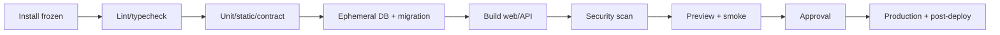
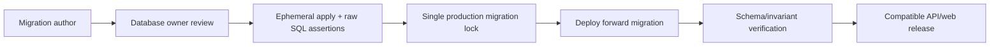
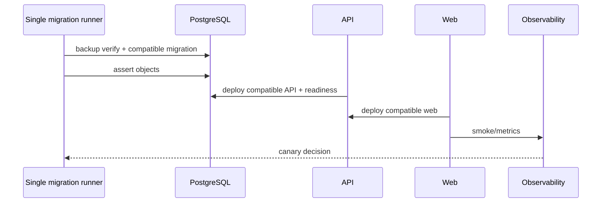
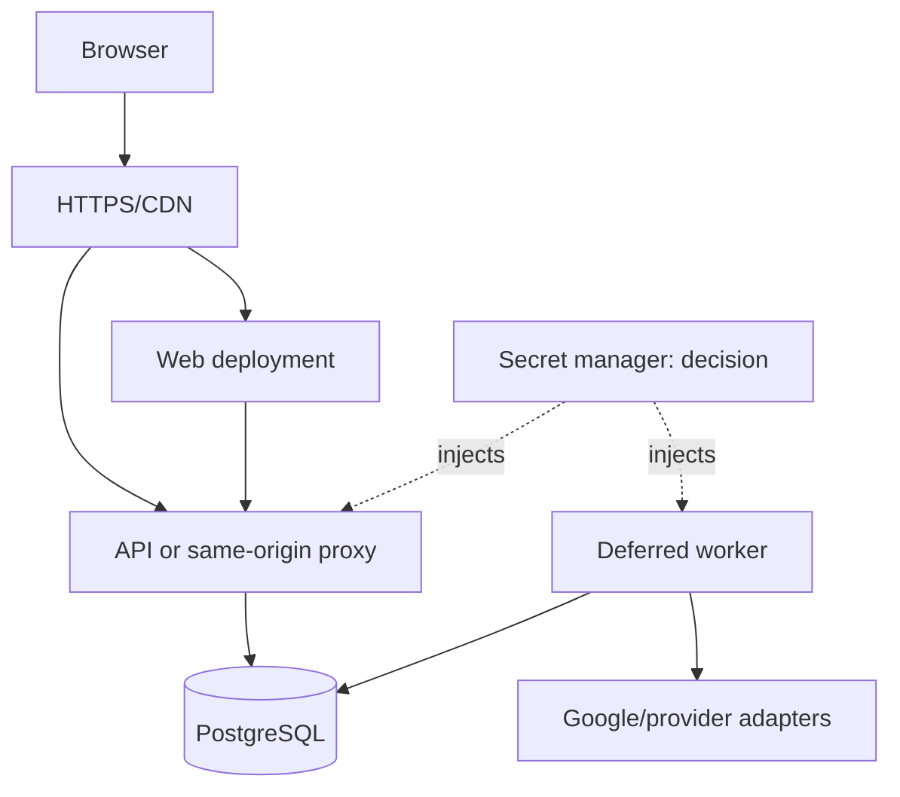
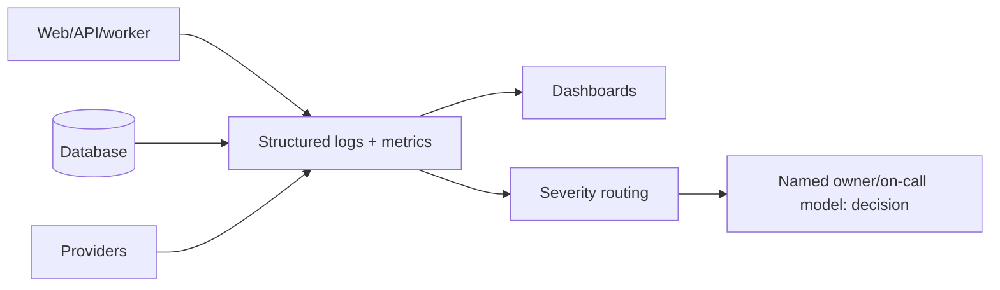
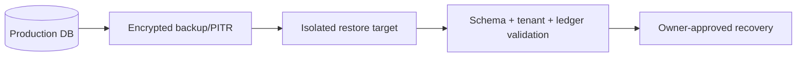
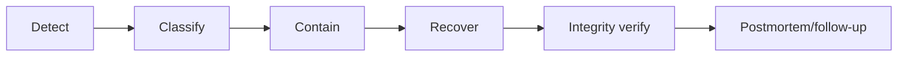

# Environment and Deployment Target Design

**CONFIRMED** statements cite repository files. All provider, SLO and operational
process choices are **RECOMMENDATIONS** or **OWNER DECISIONS**. This document does not
assert an existing Vercel project, CI system, secret manager, staging database, or
on-call team merely because the code can run there.

## 1. Current deployment inventory — CONFIRMED

| Area | Repository evidence | Current implication |
|---|---|---|
| Next config | [`next.config.ts`](../../next.config.ts) | security headers, production HSTS, CSP, `allowedDevOrigins` includes the documented LAN host; no provider deployment config is present. |
| Package scripts | [`package.json`](../../package.json) | `pnpm build` is `prisma generate && next build --webpack`; `pnpm dev` is `next dev`. |
| Prisma | [`prisma/schema.prisma`](../../prisma/schema.prisma), [`lib/prisma.ts`](../../lib/prisma.ts) | PostgreSQL through Prisma/adapter; generation is required before production build. |
| Runtime validation | [`lib/server/environment.ts`](../../lib/server/environment.ts) | requires `DATABASE_URL`; production requires `AUTH_SECRET`, HTTPS `NEXT_PUBLIC_APP_URL`, explicit production environment and production DB name for verification. |
| Public URL | [`lib/public-app-url.ts`](../../lib/public-app-url.ts) | validates public origin; a LAN URL is a local testing configuration, not deployment evidence. |
| Health | [`app/api/health/live/route.ts`](../../app/api/health/live/route.ts), [`app/api/health/route.ts`](../../app/api/health/route.ts) | live is process response; readiness probes `SELECT 1`, returns no-store response and release metadata. |
| Release identity | [`lib/server/release.ts`](../../lib/server/release.ts) | public release metadata derives from validated environment naming/SHA. |
| Integration | [`lib/google-sheets.ts`](../../lib/google-sheets.ts) and safe sync helpers | Google credentials are server-side configuration; no worker deployment is confirmed. |
| CI | no `.github` workflow files found | release scripts exist but hosted CI enforcement is not confirmed. |
| Vercel | scripts/reference naming may support Vercel use, but no `vercel.json` found | **NOT CONFIRMED** hosting/provider. |

```mermaid
flowchart LR
  SRC[Repository] --> GEN[prisma generate]
  GEN --> BUILD[next build --webpack]
  BUILD --> NEXT[Single Next runtime]
  NEXT --> PG[(PostgreSQL)]
  NEXT --> H[/health + /health/live]
  NEXT --> GS[Google Sheets when sync invoked]
```

## 2. Target environment matrix — RECOMMENDATION

| Environment | URL/API | DB/role/migrations | Data/secrets | Integrations/observability | Deploy/retention/access/restore |
|---|---|---|---|---|---|
| Local | `localhost`; optionally LAN dev host; API local/proxy | local isolated DB; developer role; migrations only local | synthetic only; developer-managed non-production secrets | no real mail/Sheets/webhooks; console logs | manual; disposable; developer-only; restore not required |
| Test | CI ephemeral URL | ephemeral DB, CI test role; test migrations allowed | synthetic fixtures; CI scoped secrets | fake adapters; test logs/artifacts | per PR/job; short cleanup; CI access; recreate from migrations |
| Preview | unique PR host | preview branch/ephemeral DB, no production migration permission | synthetic or approved anonymized data | sandbox integrations only; captured errors | PR trigger; TTL cleanup; restricted reviewers; recreate/tear down |
| Staging | stable non-public or access-controlled host | production-like isolated DB; migration runner only | approved anonymized/synthetic; production secrets prohibited | sandbox providers, production-like metrics | promotion trigger; defined retention; SSO/VPN decision; restore drill target |
| Production | canonical HTTPS domain | production PostgreSQL; runtime least privilege, one migration role | real customer data; managed secrets | real provider credentials, metrics/logging/alerts | approval gate; retention/PITR owner decision; restricted access; documented RTO |

## 3. Database roles and permissions — RECOMMENDATION

| Conceptual role | Grants | Explicitly deny/avoid | Rotation/owner |
|---|---|---|---|
| Application runtime | only CRUD/schema usage needed by API/worker | DDL, database creation, broad admin | platform/database |
| Migration deployer | migration DDL and required data backfill | normal app credentials/browser use | database owner, short-lived CI/deploy credential |
| Read-only support | approved tenant-scoped read views/queries | writes, credential export, unbounded PII | support owner/time-limited |
| Backup/restore | backup/PITR/restore privilege | application traffic | database/platform |
| Analytics/reporting | approved read replica/views | source writes and raw secrets | analytics owner |
| Local developer | local database only | production DB by default | developer/local tooling |
| CI/test | ephemeral DB/schema only | production/previews without approval | CI owner, per-job |

Least privilege means runtime credentials cannot deploy schema; migration credentials
are not placed in web bundles/logs; credentials are separately revocable and rotated.

## 4. Backend hosting comparison — OWNER DECISION

| Provider | Setup/Node | long process/worker/WebSocket | pooling/network/autoscale/cold start | rollback/health/observability | cost/lock-in/ops | Now / scale |
|---|---|---|---|---|---|---|
| Railway | low; standard Node | supported service/worker; WebSocket practical | managed networking; review PG pooling; modest autoscale | deploy rollback/health/logs available, validate metrics needs | predictable early, platform lock-in, low ops | good pilot / assess limits |
| Render | low-medium; Node native | web service + worker; WebSocket practical | managed services; cold/scale policy plan-specific | health/rollback/logs, validate tracing | simple, moderate lock-in | good pilot / moderate scale |
| Fly.io | medium; container/native Node | long-running and regional processes | private network; pooling/region design required | health/logs/metrics, rollback supported | flexible, higher ops | viable / strong regional control |
| AWS ECS/Fargate | high; containers | strong worker/WebSocket support | VPC/pooling/autoscale; no traditional cold start | mature health/logs/metrics/rollback | flexible, higher fixed ops | overkill now / strong scale option |
| AWS Lambda | medium; serverless Node | unsuitable for durable worker; WebSocket needs extra services | cold starts/pooling constraints | mature platform tooling | usage-based, high architecture complexity | selective HTTP only / not default ledger-worker host |

Provider suitability is a planning comparison, not a claim about current support plans,
pricing, regional availability, or built-in compliance. Validate current vendor terms
before selection.

## 5. Domain topology — cross-reference auth design

| Topology | Deployment effect | Security/ops consequence | Status |
|---|---|---|---|
| Same-origin proxy | web host routes `/api/*` to API | simplest browser cookie/CORS boundary; proxy is availability dependency | default recommendation |
| `app`/`api` subdomains | independent web and API host | explicit CORS/credential/preview allowlists; easier native clients | owner decision |
| Web BFF/internal API | Next server keeps browser cookie and calls private API | web/BFF coupled; internal auth/scale boundary required | deferred unless SSR policy requires |

The complete cookie/CSRF/mobile matrix is in
[`AUTH_AND_TENANCY_TARGET.md`](../architecture/AUTH_AND_TENANCY_TARGET.md).

## 6. CI pipeline — target stages



| Stage | Trigger/secrets | Artifact | Failure behavior | Required |
|---|---|---|---|---|
| A Install frozen lockfile | PR/push; registry token if needed | dependency cache | stop | yes |
| B Lint | PR; none | lint report | stop | yes |
| C Typecheck | PR; none | TS report | stop | yes |
| D Unit/domain | PR; none | test results/coverage | stop | yes |
| E Static/source | PR; none | boundary/source assertions | stop | yes |
| F Contract | PR; test keys only | API schema/client artifact | stop | yes after API exists |
| G DB integration | PR; ephemeral DB credential | integration report | stop | yes for DB changes |
| H Migration validation | PR/release; ephemeral DB | schema/index assertion | stop | yes |
| I Build web | PR; public build config | web artifact | stop | yes |
| J Build API | PR; build-time non-secret config | API artifact | stop | yes after split |
| K Security/dependency scan | PR/scheduled; scanner token | SARIF/report | block severity policy | yes |
| L Preview deploy | approved PR; preview secrets | preview URL | mark failed/no promotion | recommended |
| M Smoke tests | preview/release; test identity | smoke artifact | block promotion | yes |
| N Approval gate | production candidate | signed release record | hold | owner decision |
| O Production deploy | approved release; prod deploy secrets | deployment record | rollback/forward-fix protocol | yes |
| P Post-deploy verification | production readonly/safe creds | readiness/contract evidence | incident if critical | yes |

## 7. Migration CI — target controls

| Check | Required evidence |
|---|---|
| Immutable history | committed migration names/checksums reviewed; no edit to applied migration |
| Schema consistency | `prisma validate`, generated client, schema/migration target agreement |
| Temporary application | apply all migrations to clean ephemeral PostgreSQL |
| Drift check | migration status against target DB only in authorized environment |
| Raw SQL object assertions | inspect partial indexes, constraints, enum evolution and composite FKs |
| Destructive detection | require explicit approved plan for drops/narrowing/backfill/lock risk |
| Invariant checks | reward unlock partial unique index; tenant composite FKs from current migration inventory |
| Naming/review | ordered timestamp/name, database owner approval, rollback/forward-fix note |



## 8. Low-downtime deployment sequence

1. Freeze/coordinate one migration owner and compatible release window.
2. Confirm backup/PITR and restoration contact/expectation.
3. Apply only backward-compatible migration; capture migration version.
4. Assert required schema objects, including raw SQL indexes/foreign keys.
5. Deploy compatible API/backend; run readiness and safe health checks.
6. Deploy web after API contract compatibility is confirmed.
7. Run contract and smoke tests using approved non-destructive identities.
8. Observe errors, latency, auth denials and financial invariant signals.
9. Enable canary/tenant flag; rollback web/API or disable flag on failure.
10. Remove deprecated paths only in a later release after adoption evidence.



## 9. Concurrent deployment protection — RECOMMENDATION

| Risk | Control | Failure recovery |
|---|---|---|
| Two migrations | one environment lock and one migration runner | time-bounded lock with audited manual recovery |
| Duplicate release | deployment concurrency key per environment | cancel stale candidate, retain artifact record |
| Failed lock | owner verifies runner health/version before break-glass | documented approval and event log |
| Bad application release | artifact rollback/feature kill switch | preserve schema compatibility |
| Bad migration | forward-fix preferred; DB rollback only with approved reversible plan | data repair script review and integrity verification |

## 10. Health, readiness and degraded mode

| Signal | Current / target meaning |
|---|---|
| Liveness | current `/api/health/live` confirms process and release metadata; no DB call. |
| Readiness | current `/api/health` invokes `checkReadiness` with `SELECT 1`; target includes DB timeout, schema compatibility and required config. |
| Integration health | current Sheets state is per-business; target reports aggregate without credentials/customer data. |
| Degraded mode | target defines read-only/queued integration behavior; never silently succeeds a financial command. |
| Timeouts | target bounds DB/provider calls and emits safe failure/request ID. |

### Target deployment topology — RECOMMENDATION



## 11. Observability and alerting — RECOMMENDATION

| Signal | Required shape/owner | Alert examples |
|---|---|---|
| Logs | structured JSON, request/trace ID, hashed/tenant-safe IDs; `lib/server/logging.ts` is starting point | P2 repeated safe server error |
| HTTP | route/status/latency/size without tokens | P1 auth/API 5xx increase |
| Database | connection/latency/slow query/migration events | P1 connectivity; P2 slow query |
| Security | auth failure, cross-tenant denial, rate-limit events | P0 suspected exposure; P2 brute force |
| Jobs | queue age/job retry/dead letter/provider error | P2 stalled Sheets sync |
| Financial | idempotency conflict/lock failure/invariant anomaly | P0 integrity anomaly |

| Severity | Example | Owner expectation |
|---|---|---|
| P0 | confirmed data/security compromise or ledger corruption | immediate containment, named incident lead |
| P1 | outage/login/critical earn-redeem unavailable | urgent response and stakeholder notice |
| P2 | degraded integration/performance | workday/on-call policy decision |
| P3 | warning/capacity/expiring flag | planned remediation |



## 12. Backup, DR, RPO/RTO — OWNER DECISION

| Tier | Target RPO/RTO | Backup/PITR/drill | Cost/complexity |
|---|---|---|---|
| Starter | 24h / 24h | daily backup, documented restore test annually | low |
| Business | 1h / 8h | PITR, encrypted backups, quarterly restore drill | medium |
| Critical | minutes / 1–4h | PITR, cross-region/replica decision, frequent drill | high |

| Scenario | Required response |
|---|---|
| Provider/region failure | invoke chosen provider DR, restore to approved region, validate tenant/ledger integrity |
| Accidental deletion | stop writers, identify recovery point, approved restore/repair plan |
| Corrupted migration | halt deployment, preserve evidence, forward-fix/recover only with database owner |
| Credential compromise | revoke/rotate, audit access, verify backup encryption/access logs |

Backups must be encrypted, access-controlled, retention-defined, and restored into an
isolated target first. Logical dump usefulness, PITR provider behavior, retention and
cross-region needs require selected-provider verification.



## 13. Rollback, flags, preview data and secrets

| Area | Target policy |
|---|---|
| Web/API rollback | retain immutable prior artifact; rollback only if API/schema compatibility is maintained. |
| Database | prefer forward-fix; forbid rollback after irreversible/destructive data mutation unless database owner approves restoration plan. |
| Repair scripts | reviewed, idempotent, tenant-scoped, dry-run/audit capable, incident-approved. |
| Flags | server-side, tenant allowlist/canary, kill switch, audit/expiry; read shadowing allowed; dual-write prohibited unless reconciliation design exists. |
| Preview data | synthetic-only default; anonymized snapshot only with legal/privacy approval, cleanup and access restriction; generated production-like data is lower privacy risk. |
| Secrets | separate per environment, no Git/log/client bundle, least privilege/rotation/break-glass audit, CI masking and short-lived deployment credentials. |

## 14. Incident response — RECOMMENDATION

| Step | Required action |
|---|---|
| Detect/classify | correlate health, logs, alerts and customer report; declare P0–P3. |
| Contain | disable flag/revoke credential/pause worker/rollback compatible artifact; preserve evidence. |
| Communicate | named incident lead uses owner-approved internal/customer channels. |
| Recover | restore service, forward-fix data/schema, validate tenant and ledger integrity. |
| Learn | postmortem, root cause, owner/date for follow-ups, test/alert improvement. |



## 15. Owner decisions

| Decision | Options/default | Consequence |
|---|---|---|
| Backend provider | Railway/Render/Fly/ECS/Lambda; no selection | cost, worker/network/ops model |
| Domain topology | proxy default, subdomain, BFF | cookie/CORS/deployment shape |
| Staging data | synthetic default, anonymized, generated | privacy/realism/cleanup |
| RPO/RTO | starter/business/critical | backup/PITR/drill spend |
| Backup retention/drills | selected provider policy | recoverability evidence |
| Observability/alert target | provider/team decision | detection/response ownership |
| Worker/object storage | defer until trigger, then provider choice | integration durability/assets |
| Production approval/access | manual/automated; RBAC/break-glass | deployment/security auditability |
