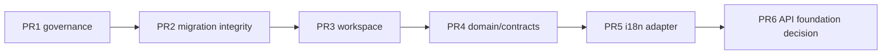
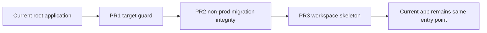
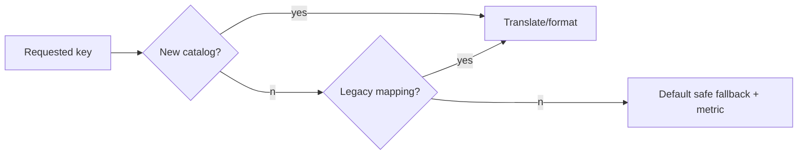
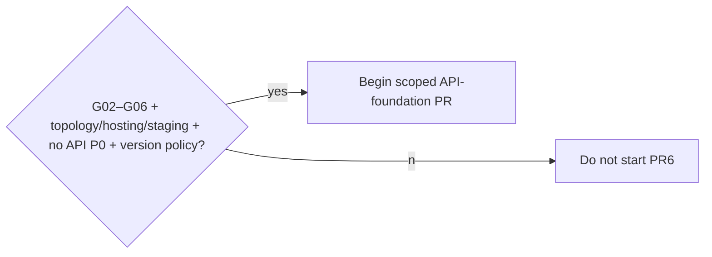

# First Five Implementation PR Specifications

**CONFIRMED** paths below exist unless marked **ADD (proposed)**. The five PRs are
future work after documentation approval; they do not authorize database/runtime/deploy
changes now. Each is independently revertible, one purpose per branch, and follows the
non-waivable gates in [`PHASE_GATES.md`](PHASE_GATES.md).

## Five-PR summary and dependency matrices

| PR | Branch/title | Phase/gate | Primary risks | Next condition |
|---|---|---|---|---|
| 1 | `chore/db-environment-governance-guards` | P0–2 / G01–G02 | R01,R24,R40,R59,R60 | environment identity/guard evidence |
| 2 | `test/migration-integrity-ci` | P2 / G03 | R01–06,R38–43 | all 38 migrations/objects verified non-prod |
| 3 | `chore/workspace-skeleton` | P3 / G04 | R33,R55,R56 | unchanged current runtime/build |
| 4 | `refactor/domain-contracts-foundation` | P4 / G05 | R11–16,R50,R57 | parity/no-domain-Prisma evidence |
| 5 | `refactor/i18n-compatibility-foundation` | P5 / G06 | R19–21,R57,R58 | AR/EN adapter parity and SSR/RTL evidence |

| Relationship | Rule |
|---|---|
| Dependency | PR2 requires PR1 guard conventions; PR3 requires G03; PR4 requires G04 and product rules; PR5 requires G04/G05. |
| Review/merge | merge in numeric order; a failure/revert invalidates downstream evidence; do not stack runtime changes. |
| Branch/commit | prefix `chore/`, `test/`, `refactor/`; focused commits: scaffolding, tests, implementation, docs; no mixed migration/UI/auth commit. |
| Global allowed | docs, scripts/tests/config only as each PR specifies; proposed package paths after PR3. |
| Global prohibited | `app/` relocation, `prisma/schema.prisma`, historical migrations, `.env*`, production DB, dependency install, hosting/auth topology change. |

## PR 1 — Database and environment governance guards

| Field | Specification |
|---|---|
| Number/title/branch | PR 1 — Database and environment governance guards; `chore/db-environment-governance-guards`. |
| Purpose/why now | make target identity, URL consistency and production-sensitive script ownership explicit before migration/tooling work. |
| Dependencies/phase/gate/risks | P0–2; G01/G02; R01,R24,R40,R59,R60; DB+Platform owner. |
| Inspect | **MODIFY only after inspection:** `package.json`, `lib/server/environment.ts`, `lib/public-app-url.ts`, `next.config.ts`, `lib/server/release.ts`, `scripts/**`, `docs/ENVIRONMENT.md`, release docs. |
| ADD / MODIFY | **ADD (proposed):** `scripts/verify-environment-governance.ts`, `tests/environment-governance.test.ts`, strategy doc. **MODIFY (proposed):** only non-runtime script/test/docs wiring approved by review. |
| Forbidden | schema/migration/seed/reset, production URL, `app/**`, API server, auth, environment files, DB command. |
| Steps/abstractions | define non-secret environment identity contract; safe target guard for sensitive scripts; URL/environment consistency assertion; release identity evidence; document dev/test/preview/staging/prod. |
| Movement/compatibility | no code movement; existing scripts retain commands and gain opt-in safe guard only after parity test. |
| DB/runtime/deploy/auth/i18n | no DB/migration/runtime/auth/i18n behavior change; deploy topology unchanged; security prevents unsafe target use; negligible performance. |
| Tests | unit fixtures for named variables; static source test; script refusal/safe-path test; no DB integration/migration/contract/E2E required. |
| Commands/manual | `pnpm lint`, `pnpm typecheck`, `pnpm test`, `pnpm build`; manual redacted env identity review. |
| Acceptance/threshold | 5: unsafe target refuses; identity explicit; local/preview cannot silently form production links; no secret output; existing checks green. |
| Stop/rollout/flag | stop if secret/runtime behavior/deploy change needed; CI warning→blocking only after owner approval; no flag/canary. |
| Rollback/forward fix/evidence | revert guard; fix false positive without bypassing policy; store CI output, redacted manual review, owner approval. |
| Review/DoD/next | DB+Platform+Security reviewers; S, 1–3 commits; DoD G02 entry evidence; PR2 starts only after approval. |

## PR 2 — Migration integrity and CI validation

| Field | Specification |
|---|---|
| Number/title/branch | PR 2 — Migration integrity and CI validation; `test/migration-integrity-ci`. |
| Purpose/why now | protect all 38 migrations and SQL-only tenant/reward invariants before workspace/domain work. |
| Dependencies/phase/gate/risks | PR1; P2/G03; R01–06,R38–43; Database owner. |
| Inspect | `prisma/schema.prisma`, every `prisma/migrations/**/migration.sql`, `package.json`, migration inventory/strategy, existing verification scripts. |
| ADD / MODIFY | **ADD:** manifest/assertion script and focused tests/CI documentation. **MODIFY:** test/package script entry only if no runtime command semantics change. |
| Forbidden | production DB/credentials, historical migration edit/delete, schema redesign/data transform/seed/reset. |
| Steps/abstractions | immutable directory/checksum inventory; temporary DB-only ordered application; schema/client generation; drift plan; destructive SQL review; naming/one-runner/staging-first policy. |
| Compatibility/impacts | no app API/auth/i18n/runtime change; DB target is test-only; deployment receives a preflight gate; no performance cost in runtime. |
| Tests | manifest removal/edit fixture; 38 ordered migration application; `RewardUnlock_one_live_per_customer_reward` assertion; composite tenant FK assertions; enum review; generated client validation. |
| Commands/manual | approved temporary-DB command only; lint/type/test/build; manual DB owner SQL review. |
| Acceptance/threshold | 6: 38 apply in order; changed/missing fails; raw objects exist; destructive change blocks/requires approval; generated client succeeds; no prod access. |
| Stop/rollout/rollback | stop if target cannot be proven non-production; CI initially required after owner trial; revert check only, never applied migration. |
| Evidence/review/DoD/next | CI logs/schema report/owner signoff; DB+Platform reviewers; M, 2–4 commits; PR3 starts after G03 passes. |

## PR 3 — Monorepo/workspace skeleton without runtime relocation

| Field | Specification |
|---|---|
| Number/title/branch | PR 3 — Monorepo/workspace skeleton without runtime relocation; `chore/workspace-skeleton`. |
| Purpose/why now | reserve ownership boundaries while preserving current Next root and deployment output. |
| Dependencies/phase/gate/risks | PR2; P3/G04; R33,R55,R56; Architect+Tooling owner. |
| Inspect | `package.json`, `pnpm-workspace.yaml`, TS/import/build/test config, target architecture. |
| ADD / MODIFY | **ADD:** minimal `packages/{domain,contracts,i18n,config}` manifests/readmes; optional `apps/{web,api}` readme placeholders only. **MODIFY:** workspace config/boundary test docs. |
| Placeholder decision | **RECOMMENDATION:** defer `apps/web`/`apps/api` package manifests unless their presence is proven not to alter package resolution; package placeholders are safer. |
| Forbidden | move `app/` or `prisma/`, active API server, Vercel root/output, dependency duplication, production build change, runtime aliases without tests. |
| Steps/compatibility | declare package names/import direction; create boundary scan; retain root scripts/entry point; no code move. |
| Impacts | DB/migration/auth/i18n/deploy unchanged; runtime build equivalence required; tooling-only performance risk. |
| Tests/commands | workspace deterministic install/lock check; cycle/import scan; existing lint/type/test/build; manual compare build entry/output. |
| Acceptance/threshold | 5: same app entry; green equivalent tests/build; deterministic workspace; no cycle; no runtime import change. |
| Stop/rollout/rollback | stop if resolution/output changes; merge skeleton only; revert files/config; no canary. |
| Evidence/review/DoD/next | build logs/import graph/architect approval; M, 2–3 commits; PR4 begins only after G04. |

## PR 4 — Shared domain and contracts extraction without behavior change

| Field | Specification |
|---|---|
| Number/title/branch | PR 4 — Shared domain and contracts extraction without behavior change; `refactor/domain-contracts-foundation`. |
| Purpose/why now | create a single pure authority for already-tested calculations/DTOs before transport. |
| Dependencies/phase/gate/risks | PR3 + product rules; P4/G05; R11–16,R50,R57; Domain+API owner. |
| Inspect | pure candidates in `lib/rewards/**`, `lib/loyalty/**`, `lib/customers/**`, `lib/validation/**`, current tests and API matrix. |
| ADD / MODIFY | **ADD:** `packages/domain/**`, `packages/contracts/**`, focused parity/import tests. **MODIFY:** only compatible re-exports/imports for selected pure slice. |
| Forbidden | Earn/Redeem/Adjustment orchestration, Prisma/Next/HTTP imports in domain, Prisma model DTOs, duplicate logic, schema/API cutover. |
| Steps/abstractions | select one proven pure helper family; move one implementation; define primitive DTO/problem types; compatibility re-export; enforce dependency direction. |
| Impacts | no DB/migration/deploy/auth/i18n behavior change; security retains server authorization; no performance regression expected. |
| Tests | existing tests unchanged/through re-export; new golden parity/domain tests; static forbidden-import/cycle/Prisma-type scan; no DB/migration/E2E needed. |
| Commands/manual | lint/type/test/build; manual output comparison for documented fixtures. |
| Acceptance/threshold | 5: equivalent outputs; green existing tests; zero forbidden imports/generated types; zero cycles; old imports work. |
| Stop/rollout/rollback | stop on transaction orchestration/semantic ambiguity; no flag; restore legacy export/import as forward fix. |
| Evidence/review/DoD/next | parity artifact/import scan/domain+API review; M, 3–5 commits; PR5 begins after G05. |

## PR 5 — I18N foundation and compatibility adapter

| Field | Specification |
|---|---|
| Number/title/branch | PR 5 — I18N foundation and compatibility adapter; `refactor/i18n-compatibility-foundation`. |
| Purpose/why now | establish target catalog/runtime without changing locale ownership or rewriting 47 current sources. |
| Dependencies/phase/gate/risks | PR3–4; P5/G06; R19–21,R57,R58; I18n+Frontend owner. |
| Inspect | `lib/i18n.ts`, `components/authenticated-locale-shell.tsx`, one low-risk `sharedDictionary`/navigation consumer, language tests and i18n plan. |
| ADD / MODIFY | **ADD:** `packages/i18n/{messages/en,messages/ar,runtime,formatting,validation,testing,types}` and adapter tests. **MODIFY:** one low-risk common/navigation source/consumer only. |
| Forbidden | mass copy rewrite, all dictionary replacement, locale ownership/URL/public-card change, business logic in formatter, dependency selection without owner decision. |
| Steps/abstractions | typed key parity; `resolveLocale/getMessages/createTranslator/t`; new→legacy→default fallback; migrate common button/navigation slice; record bundle size. |
| Impacts | no DB/migration/auth/deploy change; visible language/RTL stays same; no user-generated text translation; security logs keys only. |
| Tests | AR/EN parity, missing-key/interpolation, adapter fallback, formatting deterministic fixture, SSR/hydration, RTL/a11y snapshot; no DB/migration/contract API test. |
| Commands/manual | lint/type/test/build; manual AR/EN switch, keyboard/RTL and bundle comparison. |
| Acceptance/threshold | 6: parity; controlled missing fallback; no visible regression; unchanged RTL; measured bundle; existing language tests green. |
| Stop/rollout/rollback | stop on changed persistence/hydration/product terminology dispute; isolated component rollout; legacy adapter fallback/revert slice. |
| Evidence/review/DoD/next | key report/screenshots/bundle/owner approval; M, 3–5 commits; PR6 conditions below. |

## Cross-PR rollback, evidence, owners and PR 6 readiness

| PR | Rollback/forward fix | Required stored evidence | Owner decision |
|---|---|---|---|
| 1 | revert guard/fix false positive | redacted identity fixture, CI, owner review | environment/production mutation policy |
| 2 | revert test guard; forward-fix future migration only | manifest, temp DB/SQL report | DB runner/destructive review/staging-first |
| 3 | revert skeleton/config | build equivalence/import graph | placeholders now vs defer |
| 4 | compatibility export/revert import | golden parity/forbidden import scan | selected pure slice |
| 5 | legacy fallback/revert slice | parity/SSR/RTL/bundle report | catalog format/runtime/fallback policy |

PR 6 may begin only when: G02/G03/G04/G05/G06 pass; PR1–5 merge evidence is
current; auth topology is recorded; backend hosting is provisionally approved; staging
strategy is approved; no unresolved P0 relevant to API extraction; API contract/version
policy is approved. PR6 is prohibited if any is absent, if an exception has expired, if
workspace changes the current build, or if a DB/security owner has not approved the
applicable decision.

