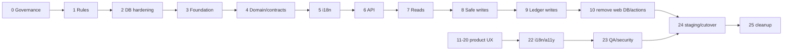
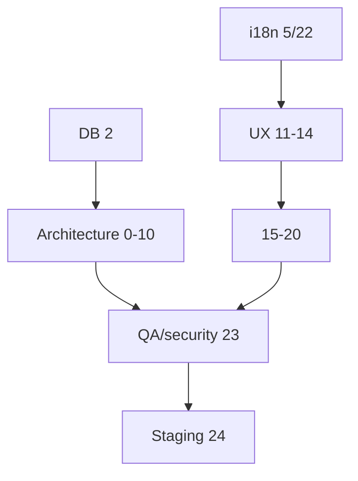
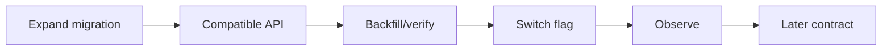
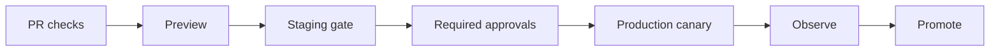
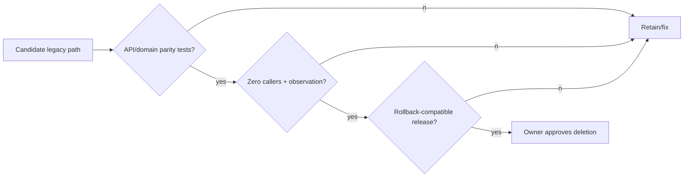
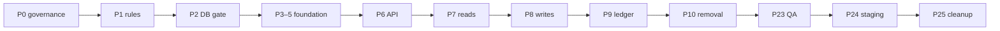
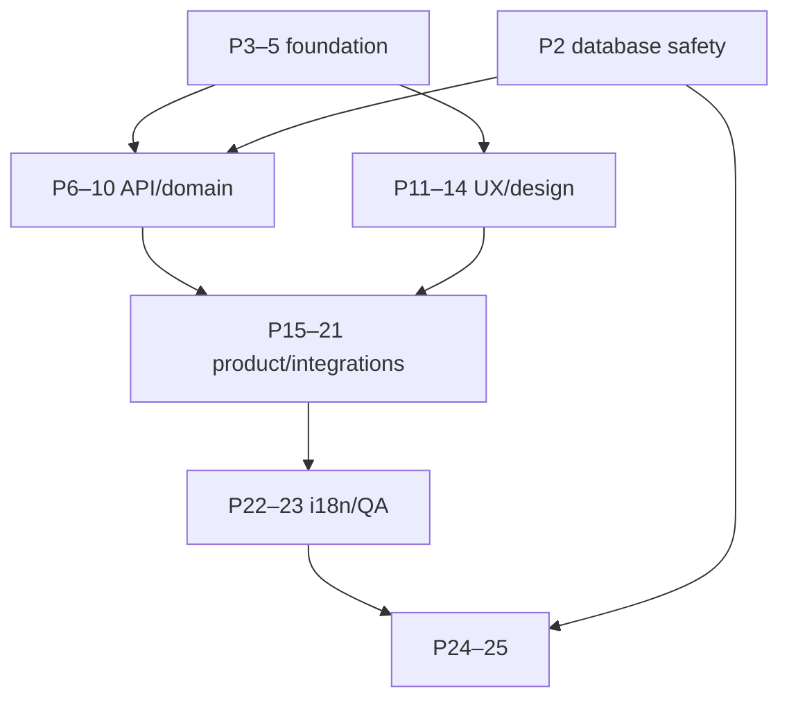

# LoyalFlow Modernization Master Execution Plan

## 1–8. Purpose, baseline, outcome, invariants, exclusions, sources, decisions, change rules

**Purpose (RECOMMENDATION):** evolve the current Next.js application into the target
web/API/domain architecture without a rewrite. **CONFIRMED baseline:** pages, actions,
handlers and 57 direct Prisma imports coexist in the current runtime; see
[`CURRENT_STATE_ARCHITECTURE.md`](../architecture/CURRENT_STATE_ARCHITECTURE.md).
**Outcome:** versioned contracts, backend-owned Prisma/migrations, web-owned UI/i18n,
and a tested operational release process as described by the target architecture.

Non-negotiable invariants: no rewrite; deployable production after each phase; immutable
migration history; no frontend DB ownership; API owns Prisma/migrations; server-enforced
tenant isolation; one ledger arithmetic source; earn/redeem/adjustment migrate last; no
legacy deletion before parity; no production-first migration; one AR/EN source of truth;
no visual change alters business semantics; expand before cleanup; every phase has
rollback or forward-fix. Excluded: provider selection, schema redesign, dependency
choice, production data mutation, and unapproved product-language decisions.

Sources are the current/target architecture, auth/tenancy, database strategy/inventory,
ERD, API matrix, i18n, and infrastructure documents listed in Task 13. Their decision
hierarchy is: data/tenant/security invariant → approved product rule → contract
compatibility → user-visible design → implementation convenience. A change requires a
named owner, source/target scope, tests, rollout, rollback and documentation update;
no phase author may silently broaden that scope.

## 9. Phase execution cards

Each row is an executable minimum: owner confirms exact paths in the API matrix before
coding; “DoD” includes stated tests, rollout evidence, observability and no unapproved
scope. Complexity is relative (S/M/L/XL).

| Phase/objective | Dependencies; exact scope/exclusions | Impacts/tests/security | rollout/rollback/DoD/PRs/risk |
|---|---|---|---|
| 0 Governance baseline | none; inventory, owners, branch/release policy; no runtime | doc path/link validation; security owner names | docs revert; approved baseline/decision log; S/P0 governance |
| 1 Product-rule freeze | 0; loyalty/reward/card/CRM semantics; no redesign | golden rule tests; tenant/ledger review | no flag; revert docs; signed rules; M/P1 drift |
| 2 DB/migration hardening | 0–1; inventory, SQL assertions, backup policy; no schema | temp DB, partial-index/composite-FK checks | CI gate; disable false-positive guard; M/P0 data |
| 3 Workspace/package foundation | 2; skeleton/config/boundary lint; no relocation | build/type/lint/import scan | revert skeleton; architecture gate; M/P2 tooling |
| 4 Shared domain/contracts | 1–3; pure proven logic/contracts; no Prisma/API | parity/unit/type tests; forbid Prisma domain imports | re-export adapter; revert package; M/P1 divergence |
| 5 i18n compatibility | 3–4; runtime/catalog tiny slice; no copy rewrite | AR/EN parity, SSR/RTL/a11y | domain flag/adapter fallback; M/P2 locale |
| 6 API foundation | 2–5; `/v1`, health, auth envelope, client generation; no ledger | authz/contract/health tests | internal/flagged endpoint; retain legacy; L/P1 auth |
| 7 Read API migration | 6; business/customer/reward/card/report reads; no critical writes | DTO query/tenant/public privacy parity | per-route flag/shadow read; legacy read fallback; L/P1 leak |
| 8 Safe-write migration | 4,6–7; customer/settings/team/branch writes; no ledger | validation/idempotency/tenant/action parity | per-command canary; legacy adapter fallback; L/P1 writes |
| 9 Critical transaction migration | 4,6–8; earn/redeem/adjust/unlock only | lock/concurrency/idempotency/ledger tests | immediate command rollback; forward-fix data; XL/P0 ledger |
| 10 Remove web Prisma/actions | 7–9 parity; eliminate imports/actions; no historical migration edits | forbidden import/consumer search/E2E | retain API v1; restore adapter only; L/P1 regression |
| 11 UX/information architecture | 1,5; information hierarchy; no semantics | role task/a11y/RTL tests | UI flag/canary; revert UI; M/P2 UX |
| 12 Design system/visual direction | 11; tokens/components; no business logic | visual/accessibility/responsive tests | component-level rollout; M/P2 visual |
| 13 Landing/auth experience | 5,6,11; public/auth UI; no topology decision | login AR/EN/mobile/security tests | route/UI flag; M/P1 login |
| 14 App shell/navigation | 5,11–12; shell/nav; no permissions change | role/nav/RTL/mobile tests | shell flag; M/P2 navigation |
| 15 Core operational flows | 7–9,11–14; scan/earn/redeem UI; no new ledger policy | Safari/device/concurrency E2E | feature flag; L/P0 operation |
| 16 Customers/CRM | 7–8,11–14; lists/profile/tags/notes; no loyalty arithmetic | tenant/filter/export/privacy tests | route flag; L/P1 data |
| 17 Canonical loyalty card | 7,11–14; public card projection/design; no token weakening | public token/metadata/RTL visual tests | card version flag; M/P1 privacy |
| 18 Growth/rewards | 4,7–8,11; rewards/offers/campaigns; no financial rewrite | eligibility/active/redeemed tests | tenant canary; L/P1 rewards |
| 19 Reports/activity/exports | 7,11,16; reports/audit/CSV; no historical alteration | date/timezone/permission/export tests | read flag; M/P1 leakage |
| 20 Platform admin/billing | 6–8,11; plans/admin/billing UI; no payment-provider change | super-admin/entitlement/audit tests | admin allowlist; L/P1 privilege |
| 21 Backend hardening/integrations | 6–10; observability, Sheets job boundary; no provider selection | retry/idempotency/secret/health tests | worker dark launch; L/P1 duplicate sync |
| 22 i18n/RTL/a11y completion | 5,11–21; remaining catalogs, bidi/a11y; no machine translation policy | key parity/visual/accessibility matrix | domain rollout; L/P2 locale |
| 23 Automated QA/perf/security | 6–22; contract/E2E/load/security suites; no feature change | CI gates, SAST, tenant/load tests | non-prod first; M/P1 blind spot |
| 24 Staging/UAT/cutover | 2,6–23; staging migration/UAT/release; no untested data change | all production no-go checks | canary/rollback rehearsal; XL/P0 release |
| 25 Cleanup/optimization | 24; legacy deletion/index/perf follow-up; no premature removal | zero consumer, telemetry, DB review | forward fix/retain v1; L/P2 debt |

## 10. Critical path and parallel work

Critical path is 0→1→2→3→4→5→6→7→8→9→10→23→24→25. Product phases 11–14
may start after i18n foundation; 16–20 may run in parallel with read migration only
where they do not change write/ledger semantics. Operational flows (15) wait for
critical transaction parity; public card waits for read/public DTO parity; complete
RTL waits for i18n foundation; staging is mandatory before 24.

## 11. Database-safe and strangler rules

Migrations are forward, backward-compatible expand/contract: add nullable/additive
schema → deploy compatible API → backfill through reviewed job → switch readers/writers
→ observe → remove later. No applied migration edits; raw SQL partial indexes and tenant
composite FKs are asserted from the migration inventory. Legacy Server Actions become
thin adapters calling the same domain use case; do not dual-write ledger state. Delete
only with contract parity, role/tenant tests, no callers, telemetry/owner evidence, and
rollback compatibility.

## 12. Release train, branch/PR, approvals, evidence

| Item | Rule |
|---|---|
| Release train | small compatible PRs; merge → CI → preview → staging → owner-approved production canary → observation. |
| Branch/PR | one phase slice/branch; no mixed schema/UI/auth change; conventional scope and explicit rollback. |
| Approval | database owner for migration; security for auth/tenant/public; product for semantics/copy; QA for UAT; release owner for production. |
| Evidence | links to CI artifacts, migration SQL assertions, contracts, screenshots/RTL, UAT, dashboards, rollback rehearsal in phase record. |
| Documentation | update affected source document, API matrix, ERD/migration inventory and risk row in the same PR. |

### Strangler migration timeline

```mermaid
gantt
  title Compatibility-first extraction
  dateFormat  X
  section Read paths
  legacy + API shadow :0, 2
  flagged API reads :2, 2
  section Write paths
  legacy adapter calls domain :2, 2
  flagged safe writes :4, 2
  critical transaction cutover :6, 2
  section Deletion
  parity/observation :8, 2
  delete legacy only after gate :10, 1
```

### Legacy deletion decision

## 13. Programme completion

Completion requires all target architecture constraints, no web Prisma/legacy action
ownership, stable versioned contracts, transaction/concurrency parity, tested migration
and restore processes, AR/EN/RTL critical journeys, approved auth topology, active
observability, staging/UAT evidence, and closed or explicitly accepted residual risks.

## 14. Current branch, release assumptions, and terminology

**CONFIRMED:** this plan is documentation on `architecture/modernization-foundation-v1`;
the running application is a single Next App Router deployment. No hosted CI, Vercel
project, backend provider, staging environment, service identity, or production release
approval flow is asserted without owner evidence. **RECOMMENDATION:** each implementation
PR names its source branch, target release train, compatibility version, owner and
rollback decision before coding.

| Term | Meaning in this programme |
|---|---|
| Legacy | current page/action/handler path that directly reaches Prisma or owns an implicit contract. |
| Adapter | temporary server-only compatibility caller to the new domain/API; it is not a second implementation. |
| Parity | identical authorised result, error class, audit/ledger effect and user-visible semantics for agreed fixtures. |
| Expand/contract | additive compatible database change, consumer switch, observed backfill, later removal. |
| Critical write | Earn, Redeem, Adjustment, RewardUnlock or any operation changing balance/ledger. |
| Gate | evidence-based permission to promote work; a checklist alone is not a gate. |
| Owner decision | choice reserved for a named accountable person; documentation does not implement it. |

## 15. Detailed execution profiles

The following profiles supplement the phase-at-a-glance matrix in section 9. Every
profile uses the same required execution contract: entry prerequisites; scope and
explicit exclusions; boundary impacts; automated/manual evidence; safe rollout;
rollback/forward-fix; owner decision; exit-gate evidence. “Before API” is a deliberate
sequence marker, not permission to add browser database access.

### P0 — Governance and baseline

| Field | Execution requirement |
|---|---|
| Objective/rationale | Create trusted baseline for a no-rewrite programme; current evidence is distributed across architecture/API/ERD documents. |
| Dependencies/gates/owner | none; architect, product, DB, security and release owners; entry is clean scope/owner list. |
| Scope/exclusions | baseline inventory, decision log, release/branch policy; exclude runtime/schema/deployment change. |
| Evidence/targets | `docs/**`, `package.json`, `prisma/migrations`; target is governed delivery, not a code module. |
| Impact/security/i18n | none except classifying tenant, ledger and Arabic/English invariants. |
| Tests/manual | path/link/status validation; owner review of terminology and risk IDs. |
| Rollout/rollback/observability | docs merge/revert; record decision timestamps; no flag. |
| Exit/DoD/PR/risk | Gate 1/2 entry artifacts, named owners and evidence store; PR 1 prerequisite; S/P0; store approved baseline. |

### P1 — Product-rule freeze

| Field | Execution requirement |
|---|---|
| Objective/rationale | Freeze canonical balance, reward target, eligibility, unit and public-card semantics before extraction. |
| Dependencies/gates/owner | P0; Product-rule gate; product + domain owner. |
| Scope/exclusions | golden examples from `lib/loyalty`, `lib/rewards`, cards; exclude redesign, new loyalty policy and historical rewrite. |
| Boundary impact | identifies one business-rule source; no API/DB/i18n implementation yet. |
| Tests/manual | exhaustive happy/edge examples, inactive customer/reward, expiry, tie-break and money scale review. |
| Rollout/rollback | documentation/test-only; revise approved rule set before P4/P9. |
| Exit/DoD | signed rule table and tests referenced by P4/P9; M/P1; evidence is product approval. |

### P2 — Database and migration hardening

| Field | Execution requirement |
|---|---|
| Objective/rationale | Protect the 38-migration history and SQL-only integrity objects before any extraction. |
| Dependencies/gates/owner | P0–1; database-safety/migration-integrity gates; DB owner. |
| Scope/exclusions | manifest, temporary DB apply, partial-index/composite-FK assertions, backup policy; exclude new schema/data/prod migration. |
| Evidence/targets | migration inventory; `20260720210000_add_reward_expiration`, `20260723044900_enforce_tenant_composite_foreign_keys`. |
| Tests/manual | clean DB, `prisma validate/generate`, SQL object assertions, restore rehearsal plan. |
| Rollout/rollback | CI-only then required gate; disable bad assertion, never edit applied migration. |
| Exit/DoD | Gate 2–3 evidence and DB approval; PR2; M/P0; store CI artifact and owner sign-off. |

### P3 — Workspace and package foundation

| Field | Execution requirement |
|---|---|
| Objective/rationale | Reserve target ownership boundaries without a cosmetic mass move. |
| Dependencies/gates/owner | P2; architecture-foundation; architect/tooling owner. |
| Scope/exclusions | workspace/package manifests and import rules; exclude relocating `app`, deploy target, Prisma ownership/dependencies. |
| Tests/manual | install/build/type/lint equivalence; import-boundary scan. |
| Rollout/rollback | empty skeleton only; revert configuration if resolution changes. |
| Exit/DoD | Gate 4; PR3; M/P2; evidence shows unchanged runtime. |

### P4 — Shared domain and contract extraction

| Field | Execution requirement |
|---|---|
| Objective/rationale | extract only tested pure rules/DTOs so later callers share one implementation. |
| Dependencies/gates/owner | P1–3; domain-contract gate; domain/API owners. |
| Scope/exclusions | pure `lib` candidates and typed errors; exclude Prisma, HTTP, action cutover, ledger algorithm change. |
| Tests/manual | golden parity, no Prisma/domain import, contract type checks; review source authority. |
| Rollout/rollback | compatibility re-export, one authority, revert import path. |
| Exit/DoD | Gate 5; PR4; M/P1; evidence includes changed-output comparison. |

### P5 — I18N compatibility foundation

| Field | Execution requirement |
|---|---|
| Objective/rationale | establish one catalog/runtime path before UI migration; current inventory has 47 sources. |
| Dependencies/gates/owner | P3–4; i18n-foundation; i18n/web owner. |
| Scope/exclusions | catalog/types/adapter and one low-risk slice; exclude language persistence change/mass translation. |
| Tests/manual | AR/EN key parity, missing keys, SSR/hydration, RTL/a11y sample. |
| Rollout/rollback | new→legacy adapter fallback and isolated slice flag. |
| Exit/DoD | Gate 6; PR5; M/P2; store bundle and visual evidence. |

### P6 — API foundation

| Field | Execution requirement |
|---|---|
| Objective/rationale | establish v1 contract/auth/health observability without moving critical operations. |
| Dependencies/gates/owner | P2–5; API-foundation, auth/tenancy decision; API/security owner. |
| Scope/exclusions | version envelope, typed client generation, request IDs; exclude ledger and final topology/provider. |
| Tests/manual | contract/authz/health/error and cookie/topology test plan. |
| Rollout/rollback | internal/flagged endpoint; legacy remains authoritative. |
| Exit/DoD | Gate 7; L/P1; evidence includes approved auth option and safe route sample. |

### P7–P10 — extraction sequence

| Phase | Preconditions/scope | Exclusions and non-negotiable test | Rollout/exit evidence |
|---|---|---|---|
| P7 Read API | P6; customer, business, rewards, public card, reports in API-matrix order | no critical writes; DTO/tenant/public privacy/shadow-read tests | route flag, legacy fallback; Gate 8 parity evidence |
| P8 Safe write | P4/P6/P7; customer/settings/team/branch commands | no ledger; validation/authz/idempotency/audit parity | command canary; Gate 9; adapter rollback |
| P9 Critical transaction | P1/P4/P6–8; Earn/Redeem/Adjustment/Unlock in `lib/loyalty/transactions.ts` | no arithmetic rewrite; lock/race/idempotency/balance SQL tests | narrow canary; Gate 10; immediate disable/forward fix |
| P10 Web ownership removal | all prior parity; delete direct web Prisma/action paths only per capability | no historical migration change; zero-import/route E2E/source scan | staged deletion; Gate 11–12 and observation window |

### P11–P14 — experience foundation

| Phase | Can start / blockers | Scope, test and exit |
|---|---|---|
| P11 UX/IA | after P5; parallel to reads; wait P1 | task hierarchy only; role/mobile/RTL testing; Gate 13 |
| P12 Design system | after P11/P5; parallel API | tokens/components only; visual/a11y regression; Gate 14 |
| P13 Public/auth | after P5, P6 for new auth calls; owner topology | landing/login public UX; auth/mobile AR/EN; preserve security; route flag |
| P14 Shell/navigation | after P5/P11/P12; parallel reads | capability-driven shell; nav/keyboard/RTL/mobile matrix; Gate 13–14 |

### P15–P20 — product verticals

| Phase | Must wait for | Scope/exclusion | Required evidence/exit |
|---|---|---|---|
| P15 Core operations | P9 + P11–14 | scan/earn/redeem UI, no new ledger policy | device/Safari/concurrency UAT; Gate 10/13 |
| P16 Customers/CRM | P7/P8 + P11 | lists/profile/tags/notes, no loyalty arithmetic | tenant/filter/export/privacy tests |
| P17 Canonical card | P7 + P5/P11 | public projection/card presentation, no token weakening | public-card metadata/privacy/RTL gate |
| P18 Growth/rewards | P4/P7/P8 + P1 | reward/offers/campaigns, no financial rewrite | eligibility/active/redeemed parity |
| P19 Reports/exports | P7 + P5/P11 | reports/activity/CSV, no historical data rewrite | timezone/unit/permission/export snapshots |
| P20 Admin/billing | P6/P8 + P11 | platform/billing UX, no payment provider change | Super Admin/plan/audit gate |

### P21–P25 — operational completion

| Phase | Objective/dependencies | Mandatory execution evidence |
|---|---|---|
| P21 Backend/integrations | after P6–10; worker/Sheets hardening only after durable-job trigger | retry/idempotency/secrets/health and service identity evidence |
| P22 i18n/RTL/a11y | P5 plus affected product paths | complete 47-source migration, AR/EN, accessibility/RTL Gate 19 |
| P23 QA/perf/security | P6–22 | contract/E2E/load/security/tenant suite, agreed budgets, Gate 18 |
| P24 Staging/UAT/cutover | P2/P6–23; staging required | migration rehearsal, restore, UAT, canary/rollback, Gate 17/20 |
| P25 Cleanup/optimization | P24 observation only | zero callers, flag expiry, forward cleanup, stabilization Gate 21 |

## 16. Phase cross-reference matrices

| Workstream | Phases | Source-document authority | Environment/test |
|---|---|---|---|
| DB safety | 0–2,9,24–25 | DB strategy/inventory/ERD | temp DB → staging → production canary |
| Architecture/API | 3–10,21 | target architecture/API matrix/auth target | unit/contract/isolation/health |
| i18n/UX | 5,11–22 | i18n plan/current architecture | AR/EN SSR/RTL/a11y/device |
| Product verticals | 15–20 | API matrix/product rules | role/tenant/public E2E |
| Release | 21,23–25 | infrastructure/risk/gates | load, restore, UAT, observability |

| Eligibility | Permitted phases | Blocked phases |
|---|---|---|
| Before API separation | 0–5, 11–12, selected copy/design research | P7–10, 15 and API-backed vertical cutovers |
| Parallel | 2/3, 5/11–12, 7/11–14, 16–20 after prerequisites | P9 requires prior write/read/domain evidence |
| Requires staging | P24 and legacy deletion P25 | no production migration/cutover without it |
| Legacy deletion | P10/P25 only | any active caller, missing parity, no rollback, open P0/P1 |

## 17. Owner-decision log, metrics, cost controls and interruption

| Decision/metric | Owner decision / control |
|---|---|
| Auth topology/session/revocation | security/identity selects proxy, subdomain or BFF before API exposure. |
| Provider/worker/storage/observability | platform selects only at trigger and records cost/exit plan. |
| Product language/public locale/numerals | product+i18n approve before migration of affected surface. |
| Release/RPO/RTO/access | release/DB owner chooses tier, approval and restore cadence. |
| Metrics | direct Prisma import count, legacy action count, contract coverage, tenant test pass rate, migration/restore rehearsal, AR/EN journey pass, error/latency/queue signals. |
| Cost checkpoints | after P3 package overhead, P6 topology, P21 worker/provider, P23 observability/load and before P24. |
| Debt acceptance | named risk, compensating control, expiry and owner; no acceptance of P0. |
| Incident interruption | P0/P1 freezes feature work; contain, preserve evidence, forward-fix/restore, then revalidate affected gates. |

### Critical-path diagram

### Parallel workstream diagram

