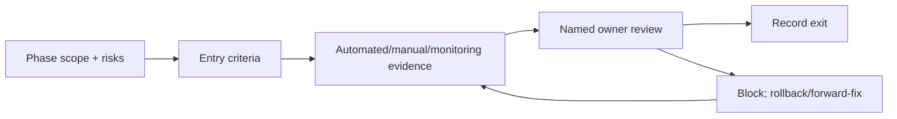
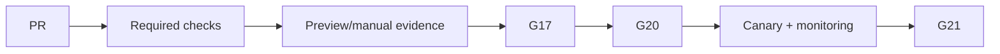
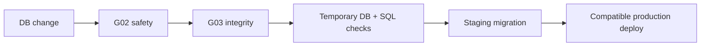
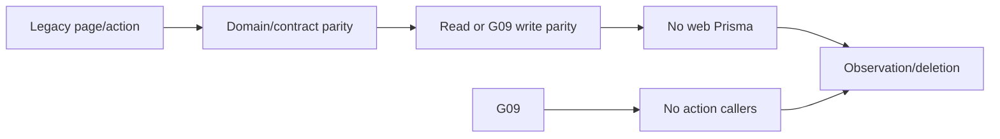
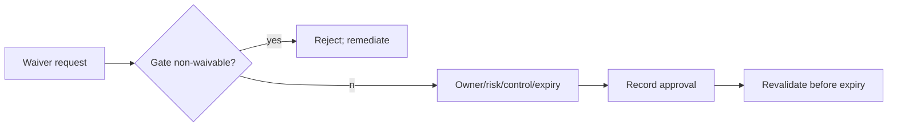

# Evidence-Based Modernization Phase Gates

This is the release-control companion to the execution plan. A gate is a recorded,
time-bounded decision based on evidence—not a meeting or a checklist. **CONFIRMED**
current evidence is cited from the repository and Task 13 documents; thresholds,
owners and controls are **RECOMMENDATIONS** pending named owner approval.

## Gate policy, evidence, waivers and manual checks

| Rule | Requirement |
|---|---|
| Entry | scope mapped to phase, risk IDs, source/target paths, accountable owner, compatible rollback/forward-fix and test plan. |
| Evidence categories | source/contract review; unit/domain; API/contract; database/migration; concurrency; security/tenant; browser/RTL/a11y; manual UAT; observability/load; release/restore. |
| Exit | required evidence passes, open risks reviewed, approval recorded with release/commit/environment/time. |
| Revalidation | expire on related source/schema/topology change; staging evidence after 30 days; cutover evidence after the next release. |
| Failure | block promotion, retain compatible legacy path/flag where available, correct and re-run gate; never alter applied migration history to “pass.” |
| Exception | only waivable gates may accept a written exception: owner, risk ID, affected tenants, compensating control, monitor, kill switch, expiry/review date. Expired exception blocks CI. |
| Non-waivable | G02, G03, G09, G10, G15, G16, G17, G20 are non-waivable for affected releases. P0 is never accepted at production cutover. |
| Deferred manual checks | real device Safari scanner, assistive technology, visual RTL, restore drill, provider failover and production-like load may be deferred only before their applicable phase; they cannot be deferred past G17/G19/G20 when relevant. |

## The 21 unique gates

| ID / gate / waiver | Purpose and entry criteria | Required artifacts/tests/database/security/manual/monitoring | Approval, exit and failure behavior |
|---|---|---|---|
| G01 Product-rule — waivable only pre-write | freeze semantics before extraction; P0–P1 and product owner assigned | approved rule examples for ledger/reward/card/units; domain tests; `lib/loyalty`, `lib/rewards`, cards review | Product+Domain approve; exit supplies golden tests; disagreement blocks P4/P9. |
| G02 Database-safety — **non-waivable** | any DB-affecting plan; DB owner and rollback approach | backup/PITR target, least-privilege role, destructive-diff review, expand/contract plan | DB owner; no DB promotion without evidence; stop change. |
| G03 Migration-integrity — **non-waivable** | before migration deploy; immutable history present | clean temporary apply; `prisma validate/generate`; raw SQL partial-index and composite-FK assertions from migration inventory | DB owner; failure is forward-fix/rehearsal, never edit applied migration. |
| G04 Architecture-foundation — waivable | before packages/boundary changes | import matrix from target architecture; workspace build/lint/typecheck; no runtime relocation evidence | Architect/tooling; revert configuration if resolution changes. |
| G05 Domain-contract — waivable | before transport reuse; P1/P4 rule evidence | pure parity, typed DTO/problem contract, no Prisma imports in domain, source authority review | Domain+API; retain compatibility export on failure. |
| G06 I18N-foundation — waivable | before broad user-copy/UI migration | AR/EN key parity, missing-key/interpolation, SSR/hydration and RTL sample from i18n plan | I18n+Web; legacy adapter fallback. |
| G07 API-foundation — waivable | before external API consumer; auth decision recorded | versioning, health/readiness, request ID, problem DTO, auth/contract tests | API+Security; endpoint remains internal/flagged on failure. |
| G08 Read-parity — waivable | before each read switch; legacy comparator exists | DTO/query parity, tenant negative tests, public-card privacy, shadow read and browser sample | API+Web; route flag returns to legacy read. |
| G09 Safe-write — **non-waivable** for write cutover | before customer/settings/team/branch write switch | boundary validation, current authz, idempotency/audit where applicable, action/API parity | API+Security; command flag disabled on failure. |
| G10 Critical-transaction — **non-waivable** | before Earn/Redeem/Adjustment/Unlock switch | `lib/loyalty/transactions.ts` parity; lock/race/idempotency/balance/unlock SQL tests; staged rehearsal | DB+Domain+Release; immediate disable/forward-fix, no automatic DB down migration. |
| G11 Frontend-Prisma-removal — waivable | before declaring web decoupled | forbidden-import scan, API E2E, zero direct `@/lib/prisma` consumers for migrated scope | Architect+Web; restore server adapter if failure. |
| G12 Server-Action-removal — waivable | before deletion of an action | replacement form/route, redirect/error/revalidation parity, caller search and E2E | Web+API; retain action until observation completes. |
| G13 UX/IA — waivable | before operational UI promotion | task map, role navigation, responsive/mobile review, no semantic rule change | Product+Web; UI flag/revert. |
| G14 Design-system — waivable | before shared component replacement | token/component contract, visual regression, keyboard/a11y, RTL sample | Design+QA; component-level rollback. |
| G15 Public-card consistency — **non-waivable** for public card | before public-card change | token/privacy, card/API/manifest DTO consistency, metadata, mobile/RTL test | Security+Product; version/flag fallback. |
| G16 Auth/tenancy security — **non-waivable** | before externally reachable API/cutover | approved topology, cookie/CORS/CSRF, revocation, tenant-isolation/role matrix, Super Admin review | Security; stop affected traffic path. |
| G17 Staging — **non-waivable** | before production; compatible candidate available | staging migration/rehearsal, readiness, backup/restore, integration and UAT evidence | Release+DB+QA; remediate staging, no prod promotion. |
| G18 Performance — waivable only with bounded non-scale scope | before scale/performance claim | agreed latency/error/connection/load budget, slow query and capacity evidence | Platform; capacity flag/rollback or defer claim. |
| G19 Accessibility/RTL — waivable only for unaffected surface | before AR/EN critical release | keyboard, screen reader, AR/EN RTL snapshots, hydration, Safari/mobile check when scanner/card affected | QA+I18n; scope rollback. |
| G20 Production-cutover — **non-waivable** | before production canary | all no-go checklist items below; compatible deploy/rollback, approval record and active alerts | Release Approver; stop/rollback canary or forward-fix. |
| G21 Post-release stabilization — waivable only before cleanup | before legacy deletion/optimization | observation window, support review, error/metric trend, zero callers/expired flags/risk review | Release+owners; postpone deletion. |

## Evidence thresholds and storage

| Evidence category | Minimum gate evidence | Storage/reference |
|---|---|---|
| Source/contract | reviewed diff, API matrix/ERD update, compatibility version | PR + linked Task 13 document section |
| Automated | zero required test failures; recorded command/version/artifact | CI run/artifact |
| Database | clean apply, generated client, SQL object/FK/index result; restore when gate requires | DB report + release record |
| Security | 100% required tenant/role cases, auth/CORS/CSRF findings resolved | security review/test artifact |
| Manual | named tester, environment, fixtures, outcome/screenshots | UAT record; no secrets/PII |
| Monitoring | dashboard/alert destination, baseline/threshold and owner | release evidence/operations record |

Quantitative threshold defaults are: zero required test failure; 100% required tenant
matrix and critical AR/EN journey pass; zero open P0; zero unaccepted P1; all required
raw SQL assertions pass; agreed latency/error budget met. A gate owner may tighten, not
silently weaken, a threshold after entry.

## Production-cutover no-go checklist — 18 items

1. No open P0; no unaccepted P1; risk review is recorded.
2. Backup and restore are tested for the selected production tier.
3. Compatible migration ran successfully in staging.
4. Schema/raw SQL assertions pass.
5. Reward-unlock partial unique index is present.
6. Composite tenant foreign keys are present.
7. API/web contract tests pass.
8. Tenant-isolation and role matrix pass.
9. Critical transaction idempotency/concurrency tests pass.
10. No invalid balance, ledger/snapshot, or unlock duplication evidence remains.
11. Auth topology, cookie/CORS/CSRF and revocation policy are approved.
12. Deployment rollback/canary was rehearsed and is compatible with schema.
13. Liveness/readiness and database dependency checks pass.
14. Logs, metrics, alerts and release identity are active and owned.
15. Public-card privacy/metadata/card-manifest checks pass.
16. Arabic and English critical journeys pass.
17. Required Safari/mobile scanner/card journeys pass.
18. Required product, DB, security, QA and release approvals are recorded.

## Gate flow diagrams

## Exception, waiver and deferred-manual-check rules

No waiver may bypass a tenant, ledger, migration-integrity, staging, public-card or
production-cutover invariant. A waivable gate exception is valid only for one stated
release/tenant scope and expires at the earliest of its recorded date, relevant code
change, or phase transition. Deferred manual checks are tracked as risk IDs and must
name device/browser/environment/fixture; QA replays them before G19 and G20 for
affected surfaces. The release approver cannot self-approve a DB/security exception.

## Gate-to-phase and owner matrix

| Phase range | Mandatory gates | Required programme roles |
|---|---|---|
| P0–P2 | G01–G03 | Product, Engineering, Database, Security |
| P3–P5 | G04–G06 | Architect, Backend, Frontend, I18n |
| P6–P10 | G07–G12, G16 | API, Domain, DB, Security, Web |
| P11–P20 | G13–G16, G19 as applicable | Product, Design, QA, Security |
| P21–P25 | G17–G21 | Platform, DB, QA, Release Approver |

Gate evidence reopens when an incident, failed monitoring signal, production rollback,
schema/contract/auth-topology change, or new relevant risk occurs. The master execution
plan and risk register must be updated in the same PR when gate applicability changes.
