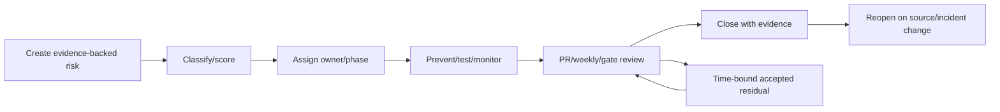
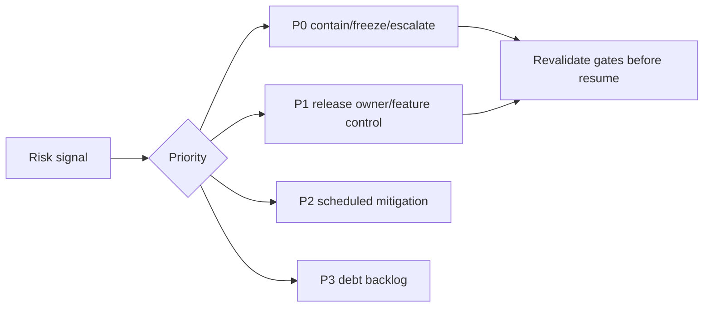
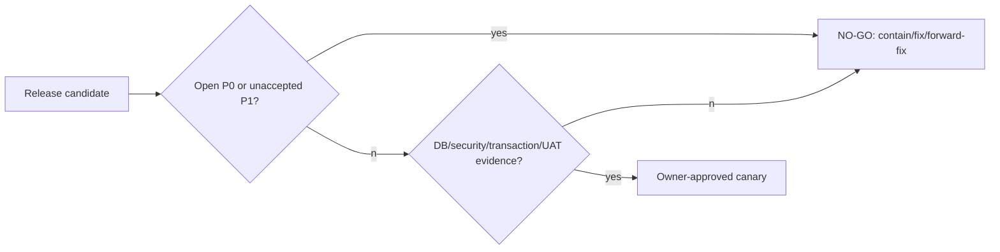
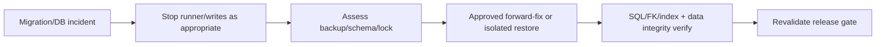
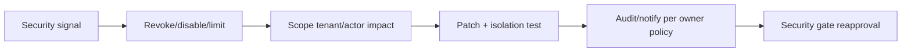
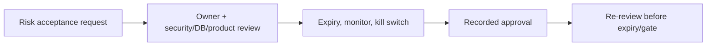

# Modernization Risk Register

Priorities: **P0** data loss/security/tenant breach; **P1** critical operation failure;
**P2** degradation; **P3** maintainability. Evidence is repository-grounded through the
architecture, migration, auth and infrastructure plans; controls below are targets.

| ID/priority/domain | Evidence/trigger/impact | Current control/gap | Prevent/mitigate/response | Monitor/test/owner/phase/closure |
|---|---|---|---|---|
| R01 P0 migration drift | 38 migrations; drift/edit applied history | inventory; no CI confirmed | immutable hash/temp apply; stop/forward fix | status/SQL assertion; DB owner/2; clean DB proof |
| R02 P0 raw SQL loss | reward unlock SQL partial index | schema cannot fully express index | raw-object assertion; halt migration | index test; DB/2; index exists |
| R03 P0 tenant FK loss | composite FK migration `20260723044900` | migration inventory only | assert FKs/review destructive diff | FK test; DB/2; DB proof |
| R04 P0 destructive migration | future drops/backfills | no production-first rule target | expand/contract/backup approval | destructive scan; DB/24; rehearsal |
| R05 P0 failed production migration | deploy ordering | scripts but no CI proof | one runner/lock/PITR | migration alert; release/24; staged success |
| R06 P0 restore failure | provider/backup not confirmed | readiness only | restore drills/owner RPO | drill evidence; DB/24; validated restore |
| R07 P0 cross-tenant access | distributed `canPerform`, 57 Prisma imports | helpers/composite FKs | canonical context/API predicates | isolation matrix; security/6–10; denial tests |
| R08 P1 stale session | `auth.ts` jwt user/authVersion read | no explicit lifetime/revoke store | topology/revocation policy | deactivate test; identity/6; proof |
| R09 P1 CSRF/CORS | no API CORS policy confirmed | same-origin forms | approved topology/CSRF tests | hostile origin test; security/6 |
| R10 P1 token enumeration | public card opaque token | token helper only | rate/hash/expiry/uniform errors | spray metric; public/7 |
| R11 P0 duplicate earn/redeem | `transactions.ts` idempotency | caller migration risk | single use case/idempotency parity | duplicate test; ledger/9 |
| R12 P0 lost row lock | `SELECT FOR UPDATE` | refactor risk | preserve transaction adapter | concurrency test; ledger/9 |
| R13 P0 invalid balance | conditional update/ledger | UI change may bypass | no client arithmetic | invariant test; ledger/9 |
| R14 P0 unlock duplication | partial live-unlock index | SQL regression risk | preserve index/conditional claim | race test; DB/9 |
| R15 P1 contract drift | actions implicit contracts | no v1 contract yet | typed DTO/version/deprecation | contract suite; API/6–10 |
| R16 P1 duplicated logic | pages/actions/services | extraction may fork rules | one use case/re-export adapter | parity tests; architecture/4–10 |
| R17 P1 premature action deletion | 54 actions | UI consumers hidden | zero-import/flag gate | source scan/E2E; web/10 |
| R18 P1 public card break | page + APIs projections | duplication | public DTO parity/privacy | card E2E; public/7/17 |
| R19 P2 locale hydration | root EN vs shell AR | distributed copy | explicit resolver/SSR test | hydration/RTL; i18n/5/22 |
| R20 P2 missing translations | 47 source inventory | no catalog parity | typed keys/CI | parity test; i18n/5 |
| R21 P2 RTL regression | UI logical layout mixed | no full matrix | RTL visual/a11y gate | snapshots; web/22 |
| R22 P1 Sheets loss/dup | in-process scheduler | no durable queue | idempotent job/outbox if needed | retry metric; integration/21 |
| R23 P1 job duplication | future worker | no service identity yet | durable job id/lease | duplicate job test; platform/21 |
| R24 P0 secret leakage | env/server modules | no secret manager confirmed | separation/redaction/rotation | secret scan; platform/0/21 |
| R25 P1 proxy spoofing | client address headers | trusted proxy not defined | trusted proxy policy | spoof test; security/6 |
| R26 P1 deploy ordering | web/API/schema coupled | no hosted CI confirmed | compatible train/locks | staged smoke; release/24 |
| R27 P1 connection exhaustion | Prisma/Postgres runtime | pooling evidence incomplete | pool/load plan | latency/connections; platform/21 |
| R28 P2 slow/N+1 queries | direct page queries | no query SLO | DTO/query review | slow query/load; API/7 |
| R29 P2 blind observability | health/log helpers only | no alerts confirmed | metrics/trace/alerts | dashboard check; platform/21 |
| R30 P1 unsafe staging data | no staging policy confirmed | docs only | synthetic/anonymized policy | audit; release/24 |
| R31 P1 schema-incompatible rollback | migrations irreversible | no universal plan | forward-fix first | rehearsal; DB/24 |
| R32 P3 vendor lock-in | provider undecided | PostgreSQL portability | provider decision/restore test | review; owner/0 |
| R33 P2 rewrite/overengineering | large programme | no hard enforcement | strangler/small PR gate | scope review; architect/all |
| R34 P2 decision delay | topology/RPO/i18n owners | decisions pending | dated owner log | governance review; owner/0 |
| R35 P1 mobile scanner | Html5Qrcode/mobile UI | Safari UAT pending | device matrix | Safari UAT; QA/15 |
| R36 P1 billing drift | entitlements/actions | distributed enforcement | contract/domain parity | role/plan test; API/20 |
| R37 P1 audit inconsistency | activities/notifications | historic text fields | stable event code/metadata | audit test; domain/19 |

## Full review fields and additional repository-grounded risks

For every row in this register, the compact columns above are interpreted as: ID/priority/domain;
evidence and affected path; trigger/impact; likelihood/detectability; current control/gap;
prevention/mitigation; immediate response and rollback/forward-fix; monitoring/alert;
automated and manual test; owner/owner decision; prevention/verification phase and blocking
gate; closure evidence; residual treatment, cadence, dependencies and assumptions. The
following rows close the remaining required risk categories; a PR must expand its affected
row into this full review form rather than treating the table as a checklist.

| ID/priority/domain | Evidence/trigger/impact | Current control/gap | Prevent/mitigate/response | Monitor/test/owner/phase/closure |
|---|---|---|---|---|
| R38 P0 migration history edited/deleted | `prisma/migrations/**`; accidental rebase/edit corrupts upgrade path | inventory, no immutable CI confirmed | manifest/review; stop release/forward migration only | checksum CI; DB/2; clean upgrade |
| R39 P1 incompatible enum change | enums in `prisma/schema.prisma`; old app rejects new value | migration strategy required | additive tolerant readers; staged deploy | contract/DB test; DB/API/2–6 |
| R40 P1 shadow/test DB misconfigured | Prisma validation/test scripts; wrong target can mutate data | env guards planned | isolated CI URL/allowlist; halt on target mismatch | target assertion; DB/2; CI proof |
| R41 P1 data backfill partial | future expand/contract job interruption | no durable backfill framework confirmed | idempotent checkpoints/count reconciliation | job metric; DB/2/24; sampled proof |
| R42 P2 cross-provider PG incompatibility | Prisma PG adapter/current migrations | provider undecided | clean apply/restore on selected PG version | compatibility run; platform/2/24 |
| R43 P1 long migration lock | raw SQL/schema future change | no lock budget configured | online/expand strategy; schedule window | lock duration alert; DB/24 |
| R44 P1 API/schema version mismatch | web/API split target | single runtime currently masks issue | compatibility matrix; deploy API before web | contract smoke; API/6/24 |
| R45 P1 client businessId trusted | scan routes accept ID but check `canPerform` | future handler may omit equality | server tenant context; negative tests | denial metric; security/6; test proof |
| R46 P1 session fixation | JWT default/no explicit rotation | topology pending | rotate login/privilege; secure cookie policy | session test; identity/6 |
| R47 P2 password reset abuse | only privileged reset action confirmed | public recovery not implemented | rate/single-use/expiry if introduced | abuse test; identity/6 |
| R48 P1 webhook spoofing | future endpoint only | no signature design | signed timestamp/event id/replay check | forged request test; API/21 |
| R49 P1 weak limiter keys | in-memory `lib/utils/rate-limiter.ts` | multi-instance behavior unknown | shared limiter/actor+IP key policy | 429 metric; security/6 |
| R50 P1 audit actor absent | `BusinessActivity` relies on caller fields | extraction can omit attribution | required ActorContext/audit schema | audit contract test; domain/8–9 |
| R51 P1 ledger snapshot divergence | `Customer.balance` + `LoyaltyTransaction` | reconciliation not guaranteed | invariant/reconciliation report | mismatch alert; ledger/9/24 |
| R52 P1 unlock expiry lifecycle | `RewardUnlock` expiry SQL | lazy cleanup/UX may drift | single eligibility predicate/expiry test | expired-action test; rewards/9 |
| R53 P1 partial side effects | transaction activity/notification in `transactions.ts` | adapter boundary risk | all effects same transaction/outbox | rollback test; ledger/9 |
| R54 P2 redirect/API mismatch | server actions redirect, API returns JSON | clients can mis-handle | stable problem mapping/adapter tests | E2E; web/API/8–10 |
| R55 P2 package cycle | target packages not yet present | skeleton can create cycles | import boundary CI | dependency graph check; architect/3–4 |
| R56 P2 workspace breaks deploy | current root build in `package.json` | workspace config could change resolution | equivalence build/lock check | build alert; tooling/3 |
| R57 P2 formatting contains rules | `lib/*presentation`, cards | extraction could decide reward/balance | pure formatting boundary tests | unit review; i18n/5/22 |
| R58 P1 technical value mirrored | RTL surfaces/technical values | distributed CSS/UI | LTR isolation tests | RTL visual; web/22 |
| R59 P1 preview hits production DB | no preview policy confirmed | environment provenance uncertain | DB role/URL guard/CI assertion | connection target audit; platform/24 |
| R60 P1 local URL public links | `NEXT_PUBLIC_APP_URL` validation | LAN test origin may be used | production URL gate/link smoke | release check; platform/1/24 |
| R61 P1 provider outage | PostgreSQL/hosting dependency | hosting/DR owner decision | readiness, backup, failover tier | uptime alert/drill; platform/24 |
| R62 P2 alert noise/unavailable | no alert provider confirmed | incident response delayed | severity routing/test alert | alert delivery drill; platform/21 |
| R63 P2 queue backlog/storage leak | worker/object storage deferred | future capacity/privacy controls absent | queue limits/signed upload/retention | depth/access alert; platform/21 |
| R64 P1 CI bypass/dependency vuln | no hosted CI workflow confirmed | checks can be skipped | protected branch/frozen lock/scan | audit/SCA; release/23 |
| R65 P2 release identity absent | `lib/server/release.ts` supports metadata | env may be missing | require SHA/environment release check | health assertion; release/24 |
| R66 P2 incident process unclear/cost growth | target docs only | owner/on-call/budgets undecided | exercise/runbook/cost checkpoints | drill/budget alert; release/21–24 |

## Heat map, top risks and no-go

| Likelihood × impact | High impact | Medium impact |
|---|---|---|
| High likelihood | R07, R11–14, R15, R26 | R19–21, R28 |
| Medium likelihood | R01–06, R08–10, R24–27, R31 | R22–23, R29–30, R35–37 |
| Low likelihood | R18, R32 | R33–34 |

Top ten: R01, R02, R03, R05, R06, R07, R11, R12, R14, R26. P0/P1 no-go: any
open R01–R18/R22–27/R31/R35–37 unless a named accountable owner formally accepts a
time-bounded residual risk; P0 is never accepted for production cutover.

## Risk governance

Each PR updates affected rows with likelihood/detectability, evidence and closure link.
Weekly phase review owns P1/P2; release review owns P0/P1. Acceptance requires product,
security, DB and release owner as relevant, expiry date, mitigation and monitoring; it
cannot waive tenant/ledger/backup invariants. Closure requires automated evidence plus
manual release evidence where specified; residual risk stays visible after release.

## Scoring, no-go policy, mapping and ownership

Impact is 1–5 (negligible to irreversible); likelihood maps Rare=1, Unlikely=2,
Possible=3, Likely=4, Almost Certain=5; detectability High=1, Medium=2, Low=3.
Priority is not arithmetic alone: any credible tenant breach/data loss is P0; a critical
operation/outage is P1; serious degradation P2; maintenance/cost inefficiency P3.
Residual treatment is Open, Reduced, Avoided, Transferred or Accepted. Acceptance needs
written rationale, accountable owner, affected users/tenants, compensating control,
kill switch/rollback, monitoring, expiry and re-review date; P0 cannot be accepted at
production cutover.

| No-go area | Block production when | Primary risks/gates |
|---|---|---|
| Database | backup/restore unverified; staging migration absent; drift/raw SQL/partial index/composite FK fails; concurrent runner/destructive non-expand change | R01–06,R38–43; gates 2,3,17,20 |
| Security | IDOR or isolation failure; insecure cookie/CORS/CSRF; public internal data; secret exposure; missing mutation auth; unsafe admin path | R07–10,R24–25,R45–50; gates 7,16,20 |
| Transactions | idempotency/concurrency/balance/reconciliation/unlock/atomicity failure | R11–14,R51–53; gates 9,10,20 |
| Release | incompatible API/schema rollback; no readiness/alerts/UAT/mobile/AR-EN proof | R26,R31,R35,R44,R61–66; gates 17–20 |

| Test class | Risks covered | Required evidence |
|---|---|---|
| Migration/database | R01–06,R38–43,R51 | clean apply, SQL object/FK/index, restore/reconciliation |
| Unit/domain/concurrency | R11–14,R51–53,R57 | golden rules, duplicate/race/expiry/format boundary |
| API/contract/security | R07–10,R15,R44–50,R54 | tenant negative, auth/CORS/CSRF/problem compatibility |
| Browser/manual UAT | R18–21,R35,R54,R58,R60 | role × AR/EN × Safari/mobile/public-card journeys |
| Load/operations | R22–23,R27–29,R61–66 | capacity, provider/retry/alert/incident drills |

| Monitoring plane | Risks/signals |
|---|---|
| Logs/audit | auth failure, request/actor/tenant denial, safe error, migration/job event: R07–10,R24–25,R50 |
| Metrics/traces | HTTP error/latency, DB pool/slow query, idempotency/lock conflict: R11–15,R27–29,R44 |
| Provider health | Sheets/job retry/queue/storage/provider availability: R22–23,R61–63 |
| Alerts | P0 immediate; P1 urgent; P2 planned; P3 review: all threshold policies owner-approved |

Required programme roles (not assumed current staffing): Product Owner (rules/copy),
Engineering Lead (scope/debt), Backend Owner (API/domain), Frontend Owner (UX/i18n),
Database Owner (migration/restore), Security Reviewer (auth/tenant), DevOps/Platform
Owner (provider/observability), QA Owner (UAT), Release Approver (cutover). Review each
PR, weekly during modernization, at every gate, staging, cutover, post-release and
immediately after incident. Valid closure evidence is test output, migration report,
screenshot, logs/metrics, review, restore report, threat review, owner decision,
staging run and an agreed production observation period.

## Residual risk after completion

Even with all gates, provider outages, account compromise, zero-day dependencies,
human error, cost growth and operational maturity remain. They are Reduced/Transferred
only through selected provider controls and rehearsed response—not eliminated by this
register. Owner decisions on RPO/RTO, provider, MFA, alert destination and staffing
therefore remain release prerequisites where their absence affects selected scope.
